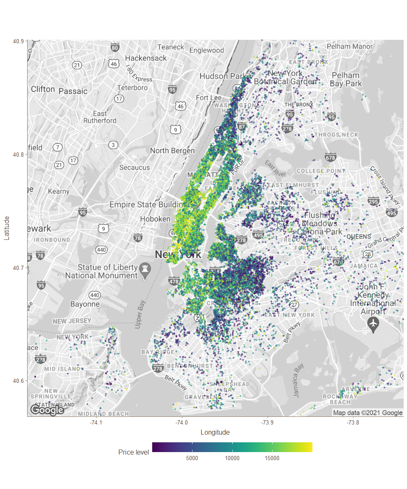
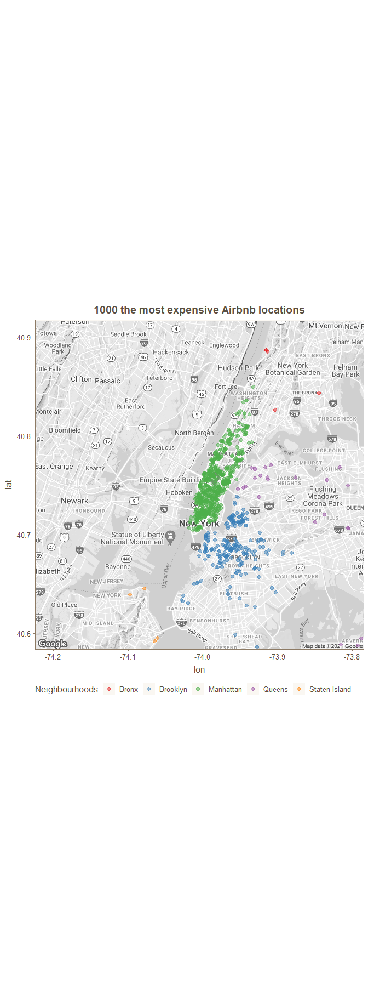
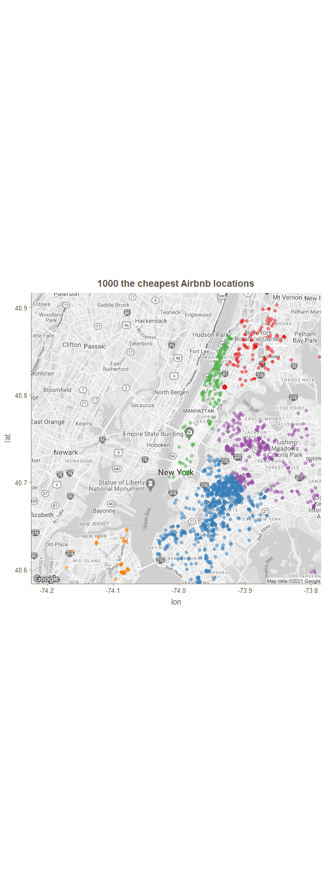
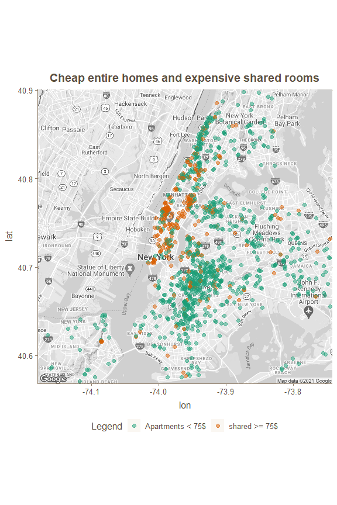
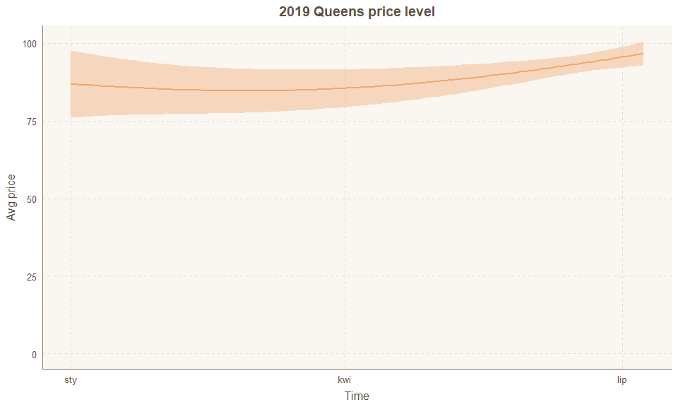

Airbnb NYC - price analysis
================
Wiktor Piela
06/04/2021

# Initial information

This dataset provides information about all of 48884 available Airbnb
locations for rent in NYC from 2011-03-28 to 2019-07-08 including some
quantitave variables like price, coordinates, amount of reviews and
availability per whole year, and qualitative, such as neighbourhood,
room type. The main purpose is to focus on price and check possible
relationships between price and rest of variables and also extract
interesting facts hidden in data.

Price distribution is very skewed to the right, with skewness
coefficient equals 19.12, it means strong positive distibution of price
and median as average measure will be reflect reality better than mean.

# Correlation and my assumptions

Without any deeper analysis I assume, that following variables could be
correlated with price:

1.  Geographical locations, because some places offer more tourist
    attractions, could be better accessible being located next to
    airport or another transport hubs.

2.  Number of reviews or indicator- reviews per month, because
    popularity and higher attendance of given places can affect on price
    positive or negative, but it shouldn’t be neutral.

3.  Availability per whole year, because low available locations could
    attract curious tourist’s attention and due to above to be more
    desired.

4.  Minimum nights for rent- the longer the rental, the more the price
    should increase, because it seems to be pretty clear, that one
    overnight stay should be cheaper than one month rental, assuming the
    similar type and quality (comparable) of both places mentioned
    before, to make this example correct.

That’s why I have created below correlation matrix and plot to visualize
the results.

<table class=" lightable-classic" style="font-family: Cambria; width: auto !important; margin-left: auto; margin-right: auto;">

<caption>

Correlation summary - price focused

</caption>

<thead>

<tr>

<th style="text-align:left;">

term

</th>

<th style="text-align:right;">

price

</th>

</tr>

</thead>

<tbody>

<tr>

<td style="text-align:left;">

longitude

</td>

<td style="text-align:right;background-color: #cfa1a4 !important;">

\-0.44

</td>

</tr>

<tr>

<td style="text-align:left;">

latitude

</td>

<td style="text-align:right;background-color: #cfa1a4 !important;">

0.14

</td>

</tr>

<tr>

<td style="text-align:left;">

minimum\_nights

</td>

<td style="text-align:right;background-color: #cfa1a4 !important;">

0.10

</td>

</tr>

<tr>

<td style="text-align:left;">

availability\_365

</td>

<td style="text-align:right;background-color: #cfa1a4 !important;">

0.09

</td>

</tr>

<tr>

<td style="text-align:left;">

number\_of\_reviews

</td>

<td style="text-align:right;background-color: #cfa1a4 !important;">

\-0.05

</td>

</tr>

<tr>

<td style="text-align:left;">

reviews\_per\_month

</td>

<td style="text-align:right;background-color: #cfa1a4 !important;">

\-0.02

</td>

</tr>

</tbody>

</table>

The most conspicuous is correlation of price with longitude, rest of
variables indicate weaker relationship related to price, however it is
worth to investigate them as well.

# Geographical location and price

Quite strong correlation between longitude and price means relationship
in this matter, so price’s level depends on location of airbnb place in
NYC, that is neighbourhood group (district).

## Districts - where are we able to stay overnight for low and for the high price?

At the beginning it is worth to mention that the most of Airbnb offers
are located both in Manhattan and Brooklyn.

If the location of particular places so noticeably affects the price, it
is interesting to note the price among the existing districts.

<table class=" lightable-classic" style="font-family: Cambria; width: auto !important; margin-left: auto; margin-right: auto;">

<caption>

Price - basic statistical measures

</caption>

<thead>

<tr>

<th style="text-align:left;background-color: #69b0d7 !important;">

neighbourhood\_group

</th>

<th style="text-align:right;background-color: #69b0d7 !important;">

min

</th>

<th style="text-align:right;background-color: #69b0d7 !important;">

Q1

</th>

<th style="text-align:right;background-color: #69b0d7 !important;">

median

</th>

<th style="text-align:right;background-color: #69b0d7 !important;">

Q3

</th>

<th style="text-align:right;background-color: #69b0d7 !important;">

max

</th>

<th style="text-align:right;background-color: #69b0d7 !important;">

mean

</th>

</tr>

</thead>

<tbody>

<tr>

<td style="text-align:left;">

Bronx

</td>

<td style="text-align:right;">

10

</td>

<td style="text-align:right;">

45

</td>

<td style="text-align:right;background-color: #cfa1a4 !important;">

65

</td>

<td style="text-align:right;">

99

</td>

<td style="text-align:right;">

2500

</td>

<td style="text-align:right;">

87.58

</td>

</tr>

<tr>

<td style="text-align:left;">

Brooklyn

</td>

<td style="text-align:right;">

10

</td>

<td style="text-align:right;">

60

</td>

<td style="text-align:right;background-color: #cfa1a4 !important;">

90

</td>

<td style="text-align:right;">

150

</td>

<td style="text-align:right;">

10000

</td>

<td style="text-align:right;">

124.44

</td>

</tr>

<tr>

<td style="text-align:left;">

Manhattan

</td>

<td style="text-align:right;">

10

</td>

<td style="text-align:right;">

95

</td>

<td style="text-align:right;background-color: #cfa1a4 !important;">

150

</td>

<td style="text-align:right;">

220

</td>

<td style="text-align:right;">

10000

</td>

<td style="text-align:right;">

196.88

</td>

</tr>

<tr>

<td style="text-align:left;">

Queens

</td>

<td style="text-align:right;">

10

</td>

<td style="text-align:right;">

50

</td>

<td style="text-align:right;background-color: #cfa1a4 !important;">

75

</td>

<td style="text-align:right;">

110

</td>

<td style="text-align:right;">

10000

</td>

<td style="text-align:right;">

99.52

</td>

</tr>

<tr>

<td style="text-align:left;">

Staten Island

</td>

<td style="text-align:right;">

13

</td>

<td style="text-align:right;">

50

</td>

<td style="text-align:right;background-color: #cfa1a4 !important;">

75

</td>

<td style="text-align:right;">

110

</td>

<td style="text-align:right;">

5000

</td>

<td style="text-align:right;">

114.81

</td>

</tr>

</tbody>

</table>

Both density plot and almost all basic statistical measures indicate
that Manhattan seems to be the most expensive places to stay overnight,
but keeping in mind the information that more than 44 percent of Airbnb
locations are in Manhattan, we need to investigate more, because it
could turn out that in Manhattan we are able to stay overnight for low
price as well.

## Price value on the NYC map

When we plot the values of each location on the map, it is possible to
see, where the price is usually higher and where lower. This allows to
notice which districts offer expensive options and which cheap ones.

The brightest area is located in Manhattan (especially downtown), and
the farther from the downtown of this district, the darker the points,
in other words- the cheaper. It confirms information getting from plot
of relationship between longitude and price- around west longitude 40,
there was a marked increase, and that is also where the downtown of
Manhattan is located.

Interesting insights can result if we plot the 1000 most expensive
locations and 1000 the cheapest ones on the map of New York.

Above maps show us some important facts and get us new knowledge about
the situation of dataset:

  - the highest concentration of the most expensive Airbnb places is in
    Manhattan, which means that when looking for a place to stay there,
    we will most likely find a rather high price, but among the 100
    cheapest places, there are also quite a lot of locations in the
    downtown of Manhattan and near the central park (be aware that these
    places could be in low availibility level)

  - if we can’t afford to stay overnight in Manhattan, we can find quite
    a lot of cheap places in the north-west part of Brooklyn, or the
    South Bronx, from where it is quite close to the most popular
    attractions of New York

  - there are a lot of cheap places next to JFK Airport, what is pretty
    big advantage

  - it is visible that the amount of the cheapest places increases with
    the distance from the downtown of Manhattan

## Price category by districts

To ultimately check, which of districts offer the most expensive Airbnb
locations and how much of them, classification the offers into
particular price categories is needed and there we have:

<table class=" lightable-classic" style="font-family: Cambria; width: auto !important; margin-left: auto; margin-right: auto;">

<caption>

Luxuries share in each district

</caption>

<thead>

<tr>

<th style="text-align:left;background-color: #69b0d7 !important;">

neighbourhood\_group

</th>

<th style="text-align:left;background-color: #69b0d7 !important;">

Price category

</th>

<th style="text-align:right;background-color: #69b0d7 !important;">

Count observation

</th>

<th style="text-align:left;background-color: #69b0d7 !important;">

Share

</th>

</tr>

</thead>

<tbody>

<tr>

<td style="text-align:left;">

Manhattan

</td>

<td style="text-align:left;">

luxury

</td>

<td style="text-align:right;">

172

</td>

<td style="text-align:left;background-color: #cfa1a4 !important;">

0.79 %

</td>

</tr>

<tr>

<td style="text-align:left;">

Staten Island

</td>

<td style="text-align:left;">

luxury

</td>

<td style="text-align:right;">

2

</td>

<td style="text-align:left;background-color: #cfa1a4 !important;">

0.54 %

</td>

</tr>

<tr>

<td style="text-align:left;">

Brooklyn

</td>

<td style="text-align:left;">

luxury

</td>

<td style="text-align:right;">

54

</td>

<td style="text-align:left;background-color: #cfa1a4 !important;">

0.27 %

</td>

</tr>

<tr>

<td style="text-align:left;">

Queens

</td>

<td style="text-align:left;">

luxury

</td>

<td style="text-align:right;">

10

</td>

<td style="text-align:left;background-color: #cfa1a4 !important;">

0.18 %

</td>

</tr>

<tr>

<td style="text-align:left;">

Bronx

</td>

<td style="text-align:left;">

luxury

</td>

<td style="text-align:right;">

1

</td>

<td style="text-align:left;background-color: #cfa1a4 !important;">

0.09 %

</td>

</tr>

</tbody>

</table>

Considering the share of locations included in individual price
categories among the districts, almost all of them have a similar
structure - the largest percentage of locations are the cheapest ones in
the 15-100 USD price range, then those with a regular price of 101-150
USD, then expensive 151-500 USD, more expensive 501- 1000 USD and luxury
over 1001$. However, there are two exceptions:

  - Bronx seems to be the cheapest district paying attention on price
    category structure because of the largest share of cheap locations-
    almost 80% of all available Airbnb places in this district Bronx
    also stands out due to the smallest share of expensive, most
    expensive places (accordingly 6.6% and 0.6% of places there) and
    there are also one location registered as luxury

  - in according to Manhattan case, cheap locations are only less than
    32 percent of overall Airbnb places there, almost 42% of expensive
    and exactly 172 luxury locations which is about 0.8% Manhattans
    places in total

In my opinion presented perspective tells a lot about prices inside each
od districts.

## Type of room by districts

Accessibility to tourist attractions and nearby to worldwide popular
places not only affect location prices, looking for next factors for
investigation, it is worth to pay attention on another qualitative
variable existing in our dataset, so room type. It may turn out that one
district is more expensive because of there are more whole flats or
apartments for rent than private or shared rooms, which are naturally
cheaper than the first one.

Basically, it occurs relationship that entire homes/apartaments are the
most expensive option, cheaper are private rooms and the cheapest shared
rooms where we have to stay overnight with other people, sometimes
strangers. Above it shoudn’t be surprised, it’s rather obvious.

Generally, in New York City, there is the highest share of entire
homes/apartments among all types of rooms for rent.

Which district offers how many given room types?

<table class=" lightable-classic" style="font-family: Cambria; width: auto !important; margin-left: auto; margin-right: auto;">

<caption>

Room types by districts

</caption>

<thead>

<tr>

<th style="text-align:left;background-color: #69b0d7 !important;">

neighbourhood\_group

</th>

<th style="text-align:left;background-color: #69b0d7 !important;">

Entire home/apt

</th>

<th style="text-align:left;background-color: #69b0d7 !important;">

Private room

</th>

<th style="text-align:left;background-color: #69b0d7 !important;">

Shared room

</th>

<th style="text-align:left;background-color: #69b0d7 !important;">

Total

</th>

</tr>

</thead>

<tbody>

<tr>

<td style="text-align:left;">

Bronx

</td>

<td style="text-align:left;">

34.77%

</td>

<td style="text-align:left;">

59.72%

</td>

<td style="text-align:left;">

5.50%

</td>

<td style="text-align:left;">

100.00%

</td>

</tr>

<tr>

<td style="text-align:left;">

Brooklyn

</td>

<td style="text-align:left;">

47.56%

</td>

<td style="text-align:left;">

50.39%

</td>

<td style="text-align:left;">

2.05%

</td>

<td style="text-align:left;">

100.00%

</td>

</tr>

<tr>

<td style="text-align:left;">

Manhattan

</td>

<td style="text-align:left;">

60.93%

</td>

<td style="text-align:left;">

36.85%

</td>

<td style="text-align:left;">

2.22%

</td>

<td style="text-align:left;">

100.00%

</td>

</tr>

<tr>

<td style="text-align:left;">

Queens

</td>

<td style="text-align:left;">

36.99%

</td>

<td style="text-align:left;">

59.51%

</td>

<td style="text-align:left;">

3.49%

</td>

<td style="text-align:left;">

100.00%

</td>

</tr>

<tr>

<td style="text-align:left;">

Staten Island

</td>

<td style="text-align:left;">

47.18%

</td>

<td style="text-align:left;">

50.40%

</td>

<td style="text-align:left;">

2.41%

</td>

<td style="text-align:left;">

100.00%

</td>

</tr>

</tbody>

</table>

The biggest share of entire homes exists in Manhattan because more than
60 percent of all available locations there. Additionally, if in
Manhattan the share of shared room would be higher than entire homes,
most likely, average price would be much lower.

Keeping in mind that average price of given room type depends on
district, I present below heatmap including price of every room type in
each district.

## Additional curiosity

In density plot whereI showed price distribution of room type, you may
notice that there exist shared rooms the are more expensive than some
entire homes.

I am talking about intersection area of two densities- price of entire
homes and shared rooms, the fact, that these densities are overlaped,
inform us in dataset exist given number of shared room, which are even
more expensive than specific entire homes for rent. Where are they
located and what about their features?

I have chosen entire homes/apartments of price smaller than 75$ and
shared rooms of price equal or higher than 75, i.e observations of the
most expensive class, which are cheaper than the more expensive
observations of the cheapest class rooms. After retrieving the set of
proper locations, satisfying the conditions, we get following place’s
distribution on the map and some insights:

  - the highest concentration of the most expensive shared rooms is in
    or around Manhattan, it confirms once again that it is the most
    expensive area

  - the concentration of the green color, i.e. apartments cheaper than
    shared rooms marked as orange color, increases with the distance
    from downtown Manhattan

  - due to the particular map distribution of these locations, a given
    separate test group accurately represents the entire community

# Price analysis over time range

Just for the record, current dataset includes all Airbnb offer from
2011-03-28 to 2019-07-08. To be aware the trend of price of locations in
every district in time range and where and how expensive it used to be,
how it is now, I present below plot of price over time.

Due to the fact that in the past in the case of some districts, the
number of observations is not sufficient to get certain conclusions, it
is necessary to consider price of each district separately over time
range.

### Manhattan

**Question: Why price of Airbnb locations in Manhattan were falling
until mid 2016?**

  - answer: in order to explain this matter, we need to refer to
    structure of room types in Manhattan before. In total, 60% of all
    available Airbnb locations in Manhattan are entire homes, however,
    before 2016 the share of this room type was about 80% and that’s why
    price level used to be maintained at higher level than next years.

### Staten Island

In the case of Staten Island, although the first offers appeared on ,
however, the representative group has been collected just in 05.2019, so
it does not make sense to consider prices in this district earlier.

Quite short period it was possible to investigate the price does not
show much, but you can see that the price is increasing slowly month by
month. It may be due to the purely economic phenomenon of an increase in
the demand for accommodation, even away from the center of Manhattan
because of the growing amount of tourists.

### Queens

Also in the case of Queens district, we can only investigate 2019,
because previously the amount of observations was not sufficient to
research the relationship of price on time.

### Bronx

### Brooklyn

