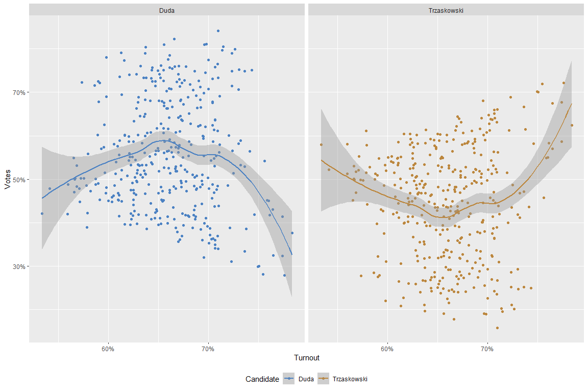
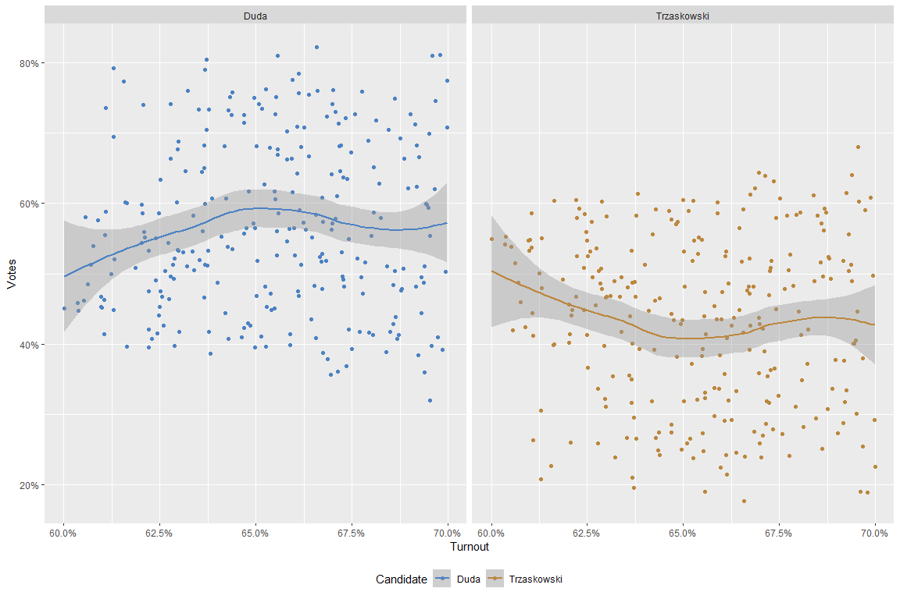

Presidential election Poland 2020 - supplement
================
Wiktor Piela
17 02 2021

# Introduction

Current document is the supplement to the earlier analysis where I
presented and initially analyzed the results of the presidential
elections in Poland in 2020. Now we will focus on some variables that
could have correlation with results of given candidate. Mentioned
elections had exceptional course and very important thing is to
investigate some of factors which occurred.

# Turnout and election results in poviats

As we know very well Overall voter turnout was 68.18 percent and was one
of the highest h in the history of Poland after 1989. In this election
were cast in total 20636635 valid votes. Basically, the turnout is
neutral measure, indicating how much election is important for citizens
and that they want to change or keep country politics, however in mass
media we are able to meet often a lot of comments, that high voter
turnout could favour given candidate - it means more or less that having
relatively high turnout, one on candidates get more votes (in given
constituency).

Let’s see results of each of candidates on the same plot with turnout.
Is there any relationship?

To summarise, there is no relationship visible, especially linear, what
we could easy measure and present any specific number. But one
phenomenon is possible to notice - Trzaskowski got more votes than Duda
in poviats, where it has been registered very low turnout or very high.
Let’s try to cut places with extreme turnout results.

Without extreme results, both of variables on the same chart seems to be
data cloud with no relationship - in addition we can mention, that
rejected observations is equal 112, what gives us proportionally 56 for
each extremum - equally 14.74 percent of all observations. Because of
only those observations could confirm any possible relationship, however
there are too few - it means that most likely there are no relationship
between turnout and results of both of candidates in poviats and
advocated by mass media platitudes related to this subject is only a
myth.

# Voting certificate

Sometimes it happens that election takes place when we are on vacation
or while traveling and if we want to cast our vote outside the place of
check-in where we use to stay regurarly, it is neccesary to get voting
certificate to make possible to vote in other electoral district. This
year it was proceeded with election during holiday season - 12 of July,
thats why there were a lot of people who wanted to vote where they spent
vacation.

<table class=" lightable-classic" style="font-family: Cambria; width: auto !important; margin-left: auto; margin-right: auto;">

<caption>

Poviats with the highest share of voting certificate votes

</caption>

<thead>

<tr>

<th style="text-align:left;">

Powiat

</th>

<th style="text-align:left;">

Województwo

</th>

<th style="text-align:right;">

country\_reference

</th>

<th style="text-align:right;">

voting\_certificate\_share

</th>

</tr>

</thead>

<tbody>

<tr>

<td style="text-align:left;">

pucki

</td>

<td style="text-align:left;">

pomorskie

</td>

<td style="text-align:right;">

2.858173

</td>

<td style="text-align:right;">

32.73561

</td>

</tr>

<tr>

<td style="text-align:left;">

leski

</td>

<td style="text-align:left;">

podkarpackie

</td>

<td style="text-align:right;">

2.858173

</td>

<td style="text-align:right;">

28.75042

</td>

</tr>

<tr>

<td style="text-align:left;">

nowodworski

</td>

<td style="text-align:left;">

pomorskie

</td>

<td style="text-align:right;">

2.858173

</td>

<td style="text-align:right;">

28.15185

</td>

</tr>

<tr>

<td style="text-align:left;">

kamieński

</td>

<td style="text-align:left;">

zachodniopomorskie

</td>

<td style="text-align:right;">

2.858173

</td>

<td style="text-align:right;">

27.94287

</td>

</tr>

<tr>

<td style="text-align:left;">

kołobrzeski

</td>

<td style="text-align:left;">

zachodniopomorskie

</td>

<td style="text-align:right;">

2.858173

</td>

<td style="text-align:right;">

26.03057

</td>

</tr>

<tr>

<td style="text-align:left;">

sławieński

</td>

<td style="text-align:left;">

zachodniopomorskie

</td>

<td style="text-align:right;">

2.858173

</td>

<td style="text-align:right;">

25.55523

</td>

</tr>

<tr>

<td style="text-align:left;">

gryficki

</td>

<td style="text-align:left;">

zachodniopomorskie

</td>

<td style="text-align:right;">

2.858173

</td>

<td style="text-align:right;">

25.25121

</td>

</tr>

<tr>

<td style="text-align:left;">

koszaliński

</td>

<td style="text-align:left;">

zachodniopomorskie

</td>

<td style="text-align:right;">

2.858173

</td>

<td style="text-align:right;">

23.01923

</td>

</tr>

<tr>

<td style="text-align:left;">

tatrzański

</td>

<td style="text-align:left;">

małopolskie

</td>

<td style="text-align:right;">

2.858173

</td>

<td style="text-align:right;">

22.86658

</td>

</tr>

<tr>

<td style="text-align:left;">

giżycki

</td>

<td style="text-align:left;">

warmińsko-mazurskie

</td>

<td style="text-align:right;">

2.858173

</td>

<td style="text-align:right;">

18.61500

</td>

</tr>

</tbody>

</table>

First of all it is important to mention that 2 of 3 outstanding provices
are the most attractive holiday destinations (pomorskie and
zachodniopomorskie) are located on the coast of the Baltic sea. In the
third area, there are a lot of lakes and forests - thanks to that it is
possible to inland sailing, hiking and camping.

There,the most votes were cast on the basis of a voting certificate
(Trzaskowski won there), but let’s check if there is a correlation
between the percentage of votes cast on the basis of the voting
certificate and the result of a given candidate, did the tourists favour
one of the candidates?

The relationship, that we assumed in here, seems to be more visible than
related to previous investigated factor - turnout and probably is
exists. Let’s count what is the specific amount of correlation between
share of voting certificate and results of each of candidate (x-axis has
been logarithmed, and it is not linear actually that’s why I use
spearman method for calculation).

<table class=" lightable-classic" style="font-family: Cambria; width: auto !important; margin-left: auto; margin-right: auto;">

<caption>

Correlation

</caption>

<thead>

<tr>

<th style="text-align:left;">

Candidate

</th>

<th style="text-align:right;">

correlation

</th>

</tr>

</thead>

<tbody>

<tr>

<td style="text-align:left;">

Duda

</td>

<td style="text-align:right;">

\-0.2460481

</td>

</tr>

<tr>

<td style="text-align:left;">

Trzaskowski

</td>

<td style="text-align:right;">

0.2460481

</td>

</tr>

</tbody>

</table>

For sure, correlation is existing in this example, but it is not too
significant - let’s cut and select only thos poviats where share of
voting certificate votes was the highest and then calculate again.

<table class=" lightable-classic" style="font-family: Cambria; width: auto !important; margin-left: auto; margin-right: auto;">

<caption>

Correlation - after cutting

</caption>

<thead>

<tr>

<th style="text-align:left;">

Candidate

</th>

<th style="text-align:right;">

correlation

</th>

</tr>

</thead>

<tbody>

<tr>

<td style="text-align:left;">

Duda

</td>

<td style="text-align:right;">

\-0.4197998

</td>

</tr>

<tr>

<td style="text-align:left;">

Trzaskowski

</td>

<td style="text-align:right;">

0.4197998

</td>

</tr>

</tbody>

</table>

Once we have eliminated poviats with more regular share of voting
certificate, correlation increased significantly - and now it is
obviously that it exists relationship between share of voting
certificate cast in poviats where those share was higher than usually
and results of each of candidate in the same plances. The share has an
impact as 17.62 percent on the candidate’s score in the poviat.

If we consider this matter based on poviats divided by categories, it is
possible to notice very quickly that liberal candidate won in
constituencies, where the share was bigger than average reference of
country overall - at the same time, his conservative opponent got the
biggest support of electors in poviats with average and smaller share.

**Insights**

  - correlation between share of votes cast on basis voting certificate
    seems to be exist - especially in places, where this share was
    higher than usually

  - the opportunity to vote on the basis of the voting certificate was
    usually used by people on vacation as well as students and citizens
    of larger cities who are not checked in there.

# Invalid votes

The invalid vote’s matter has been investigated in main election’s
report, but now we will focus on invalid votes as factor that could have
impact on election results in poviats level.

Having only above chart, it is very easy to notice that Duda got more
votes in poviats, where share of invalid votes was higher - opposite
phenomenon is able to catch in case of Trzaskowski’s results in poviats.
So correlation seems to be existed, but not to big, because of no linear
shape. Now, correlation of Spearman method is equal 0.19 and it is
possible to claim that share of invalid votes in poviats has impact of
3.61 percent.

**Insight**

  - It is not very strong correlation, however it exists most likely.

# Population and density

In main report I mentioned that Trzaskowski won in 14 of 15 the biggest
polish cities - it could mean that population of poviats (and every
other consituencies) are correlated with election results there. Let’s
check that hypothesis that Trzaskowski have got higher results in more
inhabited poviats than his opponent - President-in-Office Adnrzej Duda.

It is clearly visible that in the population range from 30,000 to
300,000 the amount of poviat inhabitants doesn’t matter for the election
results, but once in constituency are more inhabitants than 300,000,
something interesting occurred, because specific tendency appeard - the
points on the right side are the largest cities where Trzaskowski won,
which I mentioned earlier. However we cannot definitely claim, that
populantion of constituencies has direct impact on election results,
because the most of them don’t indicate any trend. To more investigate,
my proposal is to check density of population.

On the basis of the population density of poviats, it is clearly visible
that in poviats with a lower population density, Duda got more votes,
the higher the population density, the higher the percentage of votes
for Trzaskowski. About density of 500 inhabitants per 1km2, we have
there bigger cities, with advantage of Trzaskowski and more significant
tendency. Cut before we more investigate density matter, I present you
table where both of correlations are compared.

<table class=" lightable-classic" style="font-family: Cambria; width: auto !important; margin-left: auto; margin-right: auto;">

<caption>

Correlation - population vs. density

</caption>

<thead>

<tr>

<th style="text-align:left;">

Candidate

</th>

<th style="text-align:right;">

Population

</th>

<th style="text-align:right;">

Density

</th>

</tr>

</thead>

<tbody>

<tr>

<td style="text-align:left;">

Duda

</td>

<td style="text-align:right;">

\-0.1826059

</td>

<td style="text-align:right;">

\-0.2683263

</td>

</tr>

<tr>

<td style="text-align:left;">

Trzaskowski

</td>

<td style="text-align:right;">

0.1826059

</td>

<td style="text-align:right;">

0.2683263

</td>

</tr>

</tbody>

</table>

Correlation coefficient is visible higher in case of population density,
what we are able to easy notice having both charts and value of Spearman
coefficient in table, that’s why it is worth to more investigate density
matter. If we consider only poviats with density more than 500/km2 we
will get value 0.21 of Spearman coefficient, it means stronger
relationship. However it is not the end, because very significant could
be fact, that this coefficient is inscreasing if we consider next range
of population density, as below table shows:

<table class=" lightable-classic" style="font-family: Cambria; width: auto !important; margin-left: auto; margin-right: auto;">

<caption>

Cut range - value of correlation of the biggest cities

</caption>

<thead>

<tr>

<th style="text-align:left;">

Category.of.density

</th>

<th style="text-align:right;">

Coefficient.value

</th>

<th style="text-align:right;">

Count

</th>

</tr>

</thead>

<tbody>

<tr>

<td style="text-align:left;">

\>=1000

</td>

<td style="text-align:right;">

0.2876965

</td>

<td style="text-align:right;">

56

</td>

</tr>

<tr>

<td style="text-align:left;">

\>=2000

</td>

<td style="text-align:right;">

0.3357843

</td>

<td style="text-align:right;">

17

</td>

</tr>

<tr>

<td style="text-align:left;">

\>=3000

</td>

<td style="text-align:right;">

0.5000000

</td>

<td style="text-align:right;">

3

</td>

</tr>

</tbody>

</table>

# Correlation table

<table class=" lightable-classic" style="font-family: Cambria; width: auto !important; margin-left: auto; margin-right: auto;">

<caption>

Correlation between votes for Trzaskowski and Duda and other variables

</caption>

<thead>

<tr>

<th style="text-align:left;">

term

</th>

<th style="text-align:right;">

Trzaskowski

</th>

<th style="text-align:right;">

Duda

</th>

</tr>

</thead>

<tbody>

<tr>

<td style="text-align:left;">

total\_population

</td>

<td style="text-align:right;">

0.1826059

</td>

<td style="text-align:right;">

\-0.1826059

</td>

</tr>

<tr>

<td style="text-align:left;">

Invalid\_votes

</td>

<td style="text-align:right;">

\-0.1868012

</td>

<td style="text-align:right;">

0.1868012

</td>

</tr>

<tr>

<td style="text-align:left;">

Voting Certificate

</td>

<td style="text-align:right;">

0.2369976

</td>

<td style="text-align:right;">

\-0.2369976

</td>

</tr>

<tr>

<td style="text-align:left;">

Turnout

</td>

<td style="text-align:right;">

0.0177260

</td>

<td style="text-align:right;">

\-0.0177260

</td>

</tr>

<tr>

<td style="text-align:left;">

density

</td>

<td style="text-align:right;">

0.2680906

</td>

<td style="text-align:right;">

\-0.2680906

</td>

</tr>

</tbody>

</table>

**Insights**

The most correlated variables with election results are: \* population
density \* share of votes cast on basis of voting certificate \* share
of invalid votes

Below I present correlation matrix to check if other not obviously
relationship exists (not connected with results)

**Other possible relatioships**

  - population density and share of votes cast on basis of voting
    ceri=tificate

  - density and turnout

  - invalid votes and turnout (very likely, because of the more votes
    cast, the greater the probability that there will be a greater
    percentage of invalid votes)

# Cities

In general report I did basic analysis on election results in 15 the
most inhabited cities in Poland and who on there. Then, the most
important insight was that liberal candidate (Trzaskowski) won in 14 of
15 cities what shows unequivocal tendency. But now I consider the same
matter but more expand and carefully having all of cities (not only 15
the largest) and adding discrete variable - I grouped all of cities by
scopes based on amount of inhabitants.

Trzaskowski didn’t win in every city, a significant difference in votes
is visible only in really large cities, with more than 100,000
inhabitants, there Duda got much less votes than his opponent. In small,
regular and even large cities to 100,000 difference is impossible to
notice any advantage and and there was no dominant candidate.

# Population of poviats and support for candidates

As I have mentioned, presented and calculated before, it exists pretty
significant correlation between population / density of poviats and
results occurred there. Now, I divided all of constituencies by discrete
variable based on population and compile with voivodeships where they
are located.

In the most inhabited poviats, Trzaskowski got much higher advantage
counting in real votes cast there. However, even in the most liberal
provinces like pomorskie and lubuskie, in less inhabited constituencies,
the difference is about equal zero, and there is no big advantage of one
of candidates. If we consider more consevative area of Poland, advantage
of President-in-office Duda seems to be high everywhere, even in the
largest poviats. So from above heatmap come two general insights:

  - population of electoral districts is important and it has direct
    impact, who has won there

  - results depends on region of Poland

There is no specific indicator to show that, however having chart as
above, we can extract some insight independly of any measure.
