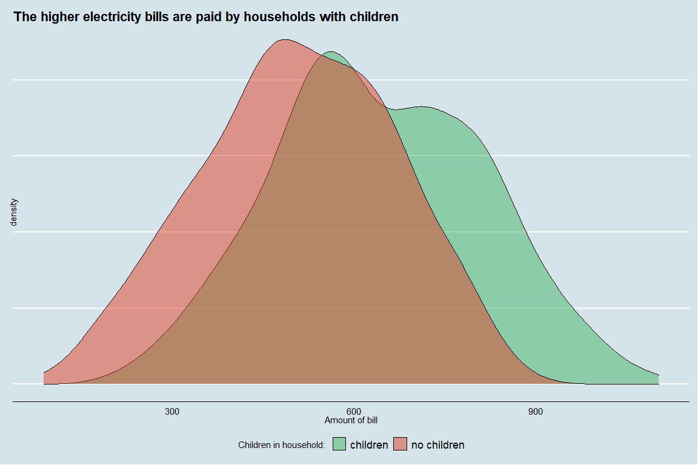

Electricity bills - insights
================
Wiktor Piela
23 02 2021

# Basic information and purpose of current analysis

Amount of electricity bill, that everyone has to pay most likely -
monthly, is very important expense of every household worldwide. Based
on current dataset including scope of 905 indian household we will try
to investigate and further explain, which factors have the strongest
direct impact on amount of monthly electricity bills.

# Correlation of quantitative variables

First thing, that we need to do, is select only quantitative variables
from dataset and calculate correlation between them and amount of
monthly bills to find direction for further steps. For this action, I
use Spearman coefficient:

<table class=" lightable-classic" style="font-family: Cambria; width: auto !important; margin-left: auto; margin-right: auto;">

<caption>

Correlation matrix - quantitative variables

</caption>

<thead>

<tr>

<th style="text-align:left;">

Variable

</th>

<th style="text-align:right;">

Coefficient value

</th>

</tr>

</thead>

<tbody>

<tr>

<td style="text-align:left;">

num\_children

</td>

<td style="text-align:right;">

0.4094283

</td>

</tr>

<tr>

<td style="text-align:left;">

num\_people

</td>

<td style="text-align:right;">

0.0778359

</td>

</tr>

<tr>

<td style="text-align:left;">

housearea

</td>

<td style="text-align:right;">

0.0776468

</td>

</tr>

<tr>

<td style="text-align:left;">

ave\_monthly\_income

</td>

<td style="text-align:right;">

0.0108215

</td>

</tr>

<tr>

<td style="text-align:left;">

num\_rooms

</td>

<td style="text-align:right;">

\-0.0340376

</td>

</tr>

</tbody>

</table>

As you can see on above correlation matrix and plot - actually, it
exists only one relationship there - between number of children in
household and amount of electricity bill. Rest of quantitative variables
have no impact on monthly paid amount.

# Number of children in households

Thanks on correlation matrix we can expect that number of children in
household has direct impact on eletricity bills, let’s investigate how
much.

In fact, relationship seems to be very strong (amost linear shape of
line), what above chart shows of specific amount of bills - approximate
amount to be paid by regular family with no children is equal 500 Indian
rupee, at the same time, family with 4 children would have to pay about
1.8 time higher amount. Below I present specific numbers among
additional informations.

<table class=" lightable-classic" style="font-family: Cambria; width: auto !important; margin-left: auto; margin-right: auto;">

<caption>

Number of children vs. electricity bill

</caption>

<thead>

<tr>

<th style="text-align:right;">

Number of children

</th>

<th style="text-align:right;">

Bill

</th>

<th style="text-align:right;">

Income

</th>

<th style="text-align:right;">

Share of income

</th>

<th style="text-align:right;">

Count

</th>

</tr>

</thead>

<tbody>

<tr>

<td style="text-align:right;">

0

</td>

<td style="text-align:right;">

508.2304

</td>

<td style="text-align:right;">

24323.36

</td>

<td style="text-align:right;">

2.089475

</td>

<td style="text-align:right;">

289

</td>

</tr>

<tr>

<td style="text-align:right;">

1

</td>

<td style="text-align:right;">

593.0336

</td>

<td style="text-align:right;">

25412.26

</td>

<td style="text-align:right;">

2.333652

</td>

<td style="text-align:right;">

336

</td>

</tr>

<tr>

<td style="text-align:right;">

2

</td>

<td style="text-align:right;">

678.8758

</td>

<td style="text-align:right;">

25487.54

</td>

<td style="text-align:right;">

2.663560

</td>

<td style="text-align:right;">

216

</td>

</tr>

<tr>

<td style="text-align:right;">

3

</td>

<td style="text-align:right;">

759.4755

</td>

<td style="text-align:right;">

25098.61

</td>

<td style="text-align:right;">

3.025966

</td>

<td style="text-align:right;">

59

</td>

</tr>

<tr>

<td style="text-align:right;">

4

</td>

<td style="text-align:right;">

902.8006

</td>

<td style="text-align:right;">

18971.03

</td>

<td style="text-align:right;">

4.758839

</td>

<td style="text-align:right;">

5

</td>

</tr>

</tbody>

</table>

I added also average monthly income for each type of family to inform
that families with more children earn less than the other ones. It
causes following phenomenon - large families use to spend more of their
income on electricity bills than those ones with with no or only 1
child; reglar family with no children pays bills of amount about 2
percent of their monthly income, family with 4 children - about 5
percent.

# Quick overview of marginal qualitative variables vs. bills amount

Some of marginal qualitative factors have impact on amount of
electricity bill - let’s see how much.

<table class=" lightable-classic" style="font-family: Cambria; width: auto !important; margin-left: auto; margin-right: auto;">

<caption>

TV’s presence in household and bills amount

</caption>

<thead>

<tr>

<th style="text-align:left;">

TV

</th>

<th style="text-align:right;">

min

</th>

<th style="text-align:right;">

Q1

</th>

<th style="text-align:right;">

median

</th>

<th style="text-align:right;">

Q3

</th>

<th style="text-align:right;">

max

</th>

<th style="text-align:right;">

mean

</th>

</tr>

</thead>

<tbody>

<tr>

<td style="text-align:left;">

no TV

</td>

<td style="text-align:right;">

87.85185

</td>

<td style="text-align:right;">

412.9688

</td>

<td style="text-align:right;">

531.6105

</td>

<td style="text-align:right;">

624.7858

</td>

<td style="text-align:right;">

1083.727

</td>

<td style="text-align:right;">

527.3192

</td>

</tr>

<tr>

<td style="text-align:left;">

TV

</td>

<td style="text-align:right;">

163.36477

</td>

<td style="text-align:right;">

493.1633

</td>

<td style="text-align:right;">

609.5536

</td>

<td style="text-align:right;">

748.9515

</td>

<td style="text-align:right;">

1102.994

</td>

<td style="text-align:right;">

616.9244

</td>

</tr>

</tbody>

</table>

As above chart presents, households having TV devices always pay higher
bills, because of obviously reasons, that devices are consuming electric
energy.

Next factor is type of home - flat or house - where it uses to pay more?

Next factor that we consider is a presence of children in household
(qualitative variable), as you can see below, it impacts on monthly bill
very much- families with children cannot save their money on electricity
charges. Regular household with children pay basically 641.59 monthly,
without children 508.23. So difference seems to be pretty high and it
indicates on correlation between presence of children and amouth to be
paid for electricity.

So not only number of children (as quantitative variable mentioned and
presented before) has great impact on subject being investigated, but
just the fact of having children (as qualitative variable).

# Bills in agglometarions

The main qualitative variable that we investigate is place of household-
in agglomaration or out of town.

Definitely, agglomeration inhabitants pay higher electricity bills than
families living out of the city, but how many higher?

<table class=" lightable-classic" style="font-family: Cambria; width: auto !important; margin-left: auto; margin-right: auto;">

<caption>

Place of household vs. electricity bill

</caption>

<thead>

<tr>

<th style="text-align:left;">

Place

</th>

<th style="text-align:right;">

min

</th>

<th style="text-align:right;">

Q1

</th>

<th style="text-align:right;">

median

</th>

<th style="text-align:right;">

Q3

</th>

<th style="text-align:right;">

max

</th>

<th style="text-align:right;">

mean

</th>

</tr>

</thead>

<tbody>

<tr>

<td style="text-align:left;">

no urban

</td>

<td style="text-align:right;">

87.85185

</td>

<td style="text-align:right;">

362.1496

</td>

<td style="text-align:right;">

456.7958

</td>

<td style="text-align:right;">

539.0306

</td>

<td style="text-align:right;">

849.4273

</td>

<td style="text-align:right;">

454.9002

</td>

</tr>

<tr>

<td style="text-align:left;">

urban

</td>

<td style="text-align:right;">

376.62313

</td>

<td style="text-align:right;">

587.4228

</td>

<td style="text-align:right;">

687.8061

</td>

<td style="text-align:right;">

791.5142

</td>

<td style="text-align:right;">

1102.9941

</td>

<td style="text-align:right;">

692.8808

</td>

</tr>

</tbody>

</table>

Every of basic statistical measures indicate that agglomeration
inhabitants have to pay more than outside households. First quartile of
amount to be paid by urban families is much higher than third Q of no
urban families. Difference is large - average difference is equal about
238 rupee, it is more than half of average electricity bill amount of no
urban household.

**It is worth to try figure out, why is it like that. Maybe more urban
household have TV devices?**

<table class=" lightable-classic" style="font-family: Cambria; width: auto !important; margin-left: auto; margin-right: auto;">

<caption>

TV devices in households

</caption>

<thead>

<tr>

<th style="text-align:right;">

TV

</th>

<th style="text-align:left;">

no urban

</th>

<th style="text-align:left;">

urban

</th>

</tr>

</thead>

<tbody>

<tr>

<td style="text-align:right;">

0

</td>

<td style="text-align:left;">

21.6%

</td>

<td style="text-align:left;">

19.0%

</td>

</tr>

<tr>

<td style="text-align:right;">

1

</td>

<td style="text-align:left;">

78.4%

</td>

<td style="text-align:left;">

81.0%

</td>

</tr>

</tbody>

</table>

Share of households having TV device grouped by places are pretty the
same, because 81% of urban households have TV, at the same time 78.4% of
outside families. Difference seems to be not too significant to cause
large difference in electricity bills like mendtioned. Maybe exists
other factor having impact? Maybe presence of children in household?

<table class=" lightable-classic" style="font-family: Cambria; width: auto !important; margin-left: auto; margin-right: auto;">

<caption>

Children in households

</caption>

<thead>

<tr>

<th style="text-align:left;">

Children

</th>

<th style="text-align:left;">

no urban

</th>

<th style="text-align:left;">

urban

</th>

</tr>

</thead>

<tbody>

<tr>

<td style="text-align:left;">

children

</td>

<td style="text-align:left;">

68.6%

</td>

<td style="text-align:left;">

67.7%

</td>

</tr>

<tr>

<td style="text-align:left;">

no children

</td>

<td style="text-align:left;">

31.4%

</td>

<td style="text-align:left;">

32.3%

</td>

</tr>

</tbody>

</table>

In this case, difference is even less than previously, because almost
the same share of families in cities have children like outside ones.
The last qualitative factor that we consider is type of home, because as
we noticed before, flat households use to pay hgher bills. Maybe in
agglomerations there is more flats?

<table class=" lightable-classic" style="font-family: Cambria; width: auto !important; margin-left: auto; margin-right: auto;">

<caption>

Type of home

</caption>

<thead>

<tr>

<th style="text-align:left;">

Type of home

</th>

<th style="text-align:left;">

no urban

</th>

<th style="text-align:left;">

urban

</th>

</tr>

</thead>

<tbody>

<tr>

<td style="text-align:left;">

flat

</td>

<td style="text-align:left;">

52.1%

</td>

<td style="text-align:left;">

52.7%

</td>

</tr>

<tr>

<td style="text-align:left;">

house

</td>

<td style="text-align:left;">

47.9%

</td>

<td style="text-align:left;">

47.3%

</td>

</tr>

</tbody>

</table>

Because of share of flats is comparable for both places, there is no
impact by this factor on amount of electricity bill. I have no more
information in current dataset being investigated to check that deeply.

**Insights**

  - presence of TV devices, children and type of home have no impact on
    amount of electricity bills in agglomerations

  - agglomeration’s household pay higher bills because of higher price
    for electricity in cities (most likely), becasue I cannot confirm
    that by current dataset

# The largest payer profile and smallest ones

We already know all factors (both qualitative and quantitative) that
have impact on amount of monthly electricity bill of regular household.
Now, having the knowledge after analysis, let’s try to find two
profiles- of the largest and the smalles payer. What kind of families
they are, what are their features and finally how many there are. For
that, I aggrgate all of variables and I calculate average monthly bill.

<table class=" lightable-classic" style="font-family: Cambria; width: auto !important; margin-left: auto; margin-right: auto;">

<caption>

Payer profils

</caption>

<thead>

<tr>

<th style="text-align:right;">

num\_children

</th>

<th style="text-align:left;">

TV device

</th>

<th style="text-align:left;">

is\_urban

</th>

<th style="text-align:right;">

Bill

</th>

<th style="text-align:right;">

Income

</th>

<th style="text-align:right;">

Count

</th>

<th style="text-align:right;">

Share of income

</th>

</tr>

</thead>

<tbody>

<tr>

<td style="text-align:right;">

0

</td>

<td style="text-align:left;">

no TV

</td>

<td style="text-align:left;">

no urban

</td>

<td style="text-align:right;">

294.1854

</td>

<td style="text-align:right;">

24514.87

</td>

<td style="text-align:right;">

22

</td>

<td style="text-align:right;">

1.20

</td>

</tr>

<tr>

<td style="text-align:right;">

4

</td>

<td style="text-align:left;">

TV

</td>

<td style="text-align:left;">

urban

</td>

<td style="text-align:right;">

1048.8253

</td>

<td style="text-align:right;">

14539.10

</td>

<td style="text-align:right;">

2

</td>

<td style="text-align:right;">

7.21

</td>

</tr>

</tbody>

</table>

The profile of the smallest payer household is following: with no TV,
without children, living out of agglometarion, they pay electricity bill
of amount about 1.2 percent of their monthly income. The families like
mentioned is 22. At the same time, family with 4 children, having TV
device and living in the city pay the largest share of their monthly
income for electricity bill- it is about 7.2%. The households like that
is 2 in current dataset.

# Other quantitative variables with no impact on electricity bills amount

It could also seem that such variables as the area of the house and the
number of people in the household significantly affect the amount of
electricity bills; however, as I proved at the beginning, those factors
don’t have any impact on that, it results from correlation matrix and
correlation plot based on Spearman coefficient. Below I present you
scatterplot of both variables to confirm that finally.

Finishing, I add below table focused on number of inhabitants with basic
data to dispel the doublts and I leave the conclusions to the reader.

<table class=" lightable-classic" style="font-family: Cambria; width: auto !important; margin-left: auto; margin-right: auto;">

<caption>

Household inhabitants - summary data

</caption>

<thead>

<tr>

<th style="text-align:right;">

num\_people

</th>

<th style="text-align:right;">

Bill

</th>

<th style="text-align:right;">

Income

</th>

<th style="text-align:right;">

Income\_per\_capita

</th>

<th style="text-align:right;">

Share\_of\_income

</th>

</tr>

</thead>

<tbody>

<tr>

<td style="text-align:right;">

1

</td>

<td style="text-align:right;">

525.7772

</td>

<td style="text-align:right;">

23089.26

</td>

<td style="text-align:right;">

23089.255

</td>

<td style="text-align:right;">

2.28

</td>

</tr>

<tr>

<td style="text-align:right;">

2

</td>

<td style="text-align:right;">

600.2807

</td>

<td style="text-align:right;">

24004.33

</td>

<td style="text-align:right;">

12002.163

</td>

<td style="text-align:right;">

2.50

</td>

</tr>

<tr>

<td style="text-align:right;">

3

</td>

<td style="text-align:right;">

588.6670

</td>

<td style="text-align:right;">

24301.58

</td>

<td style="text-align:right;">

8100.528

</td>

<td style="text-align:right;">

2.42

</td>

</tr>

<tr>

<td style="text-align:right;">

4

</td>

<td style="text-align:right;">

599.9348

</td>

<td style="text-align:right;">

25883.76

</td>

<td style="text-align:right;">

6470.939

</td>

<td style="text-align:right;">

2.32

</td>

</tr>

<tr>

<td style="text-align:right;">

5

</td>

<td style="text-align:right;">

589.1934

</td>

<td style="text-align:right;">

25542.46

</td>

<td style="text-align:right;">

5108.492

</td>

<td style="text-align:right;">

2.31

</td>

</tr>

<tr>

<td style="text-align:right;">

6

</td>

<td style="text-align:right;">

601.6646

</td>

<td style="text-align:right;">

23960.62

</td>

<td style="text-align:right;">

3993.437

</td>

<td style="text-align:right;">

2.51

</td>

</tr>

<tr>

<td style="text-align:right;">

7

</td>

<td style="text-align:right;">

617.4349

</td>

<td style="text-align:right;">

26238.83

</td>

<td style="text-align:right;">

3748.404

</td>

<td style="text-align:right;">

2.35

</td>

</tr>

<tr>

<td style="text-align:right;">

8

</td>

<td style="text-align:right;">

641.5361

</td>

<td style="text-align:right;">

23272.08

</td>

<td style="text-align:right;">

2909.009

</td>

<td style="text-align:right;">

2.76

</td>

</tr>

<tr>

<td style="text-align:right;">

9

</td>

<td style="text-align:right;">

633.9957

</td>

<td style="text-align:right;">

26332.56

</td>

<td style="text-align:right;">

2925.840

</td>

<td style="text-align:right;">

2.41

</td>

</tr>

<tr>

<td style="text-align:right;">

10

</td>

<td style="text-align:right;">

556.2567

</td>

<td style="text-align:right;">

27543.20

</td>

<td style="text-align:right;">

2754.320

</td>

<td style="text-align:right;">

2.02

</td>

</tr>

<tr>

<td style="text-align:right;">

11

</td>

<td style="text-align:right;">

605.6994

</td>

<td style="text-align:right;">

40792.07

</td>

<td style="text-align:right;">

3708.370

</td>

<td style="text-align:right;">

1.48

</td>

</tr>

</tbody>

</table>

# General insights

  - there is only one quantitative variable that has a real and direct
    impact on the amount of electricity bills - this is the number of
    children in the household

  - households with a TV pay more because of the obvious technical
    reasons

  - home area and number of people don’t affect on electricity bills

  - urban households pay much more for electricity, because of reason
    not available in dataset- probably due to higher prices

  - if average family has 4 children, TV and living in city, it is very
    likely that they spend the more share of their monthly income on
    electricity bills, than any other household, of about 7 percent of
    their income

  - if average family has no children, TV and living in out of the
    agglometarion, it is very likely that they spend the less share of
    their monthly income on electricity bills, than any other household,
    of about 1.5 percent of their income
