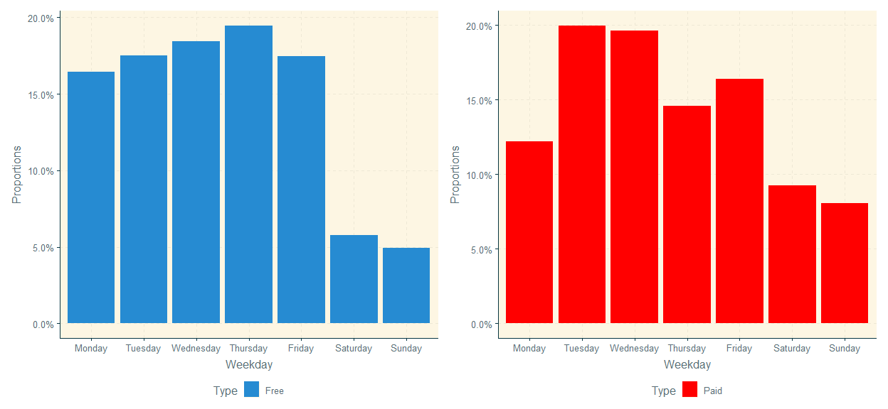

Paid and free apps - Google Play store’s content analysis
================
Wiktor Piela
24/05/2021

## Trivia

The dataset of Google Play store content includes base information about
6988 applications which have been released between 2010-05-21 and
2018-08-08. The analysis was created to find and extract interesting
relationships in the data set related to the type of application - paid
and free ones. Which application type is rated better, which application
categories are worth choosing free, and which are worth paying for,
which type require more virtual memory from device?

## Apps proportions over time

As dataset provides, until 2012 there were only free applications, after
the appearance of paid applications on the market, their share
immediately began to grow at the cost of free versions. The popularity
of paid applications grew for 2 years, until 2014, when paid
applications were almost 20 percent of all applications offered in
Google Play store, then their share for the first time began to decrease
and this trend continued until the end of the period being investigated
in 2018.

I think that, this find can be explained by a basic market rule- after
the release of paid applications, interesting users started to buy them,
probably assuming that they are better than the free ones, but the
growing competition on the market and the wider offer of free
applications have reversed the trend and free applications have again
started taking over the market.

## Release day

There is an interesting insight, based on weekday when the applications
were released, interestingly, this applies to both types.

Both charts present visible to the naked eye tendency, that devepolers
use to submit new app into Google Play store least often during
weekends, both Sundays and Saturdays. It results directly from working
time and is a rather obvious and common phenomenon.

## Which type is better rated?

It would seem that paid applications use to be rated better by users,
because they has been made more carefully and creation requires more
amount of work. On the other hand, of user paid for perticular app, it
could be more demanding and take critical approach, and finally, the
user can give lower rating for bought product.

Actually, the situation does not seem unequivocal, because the median of
paid apps is equal 4.4, and it is indeed higher than the median of free
ones (4.3)- therefore, this difference seems small because it is only
0.1 points, but taking into consideration the scale in which we consider
the app’s ratings (in fact from about 3 points up), the difference seems
to be more significant than without this insight.

To investigate deeper this subject, let’s try to find out rating of the
most common categories of apps in each type separately.

In case of each category, the paid apps look much better, their
distributions of rating are clearly moved to the right side towards free
ones scoring. So if we keep in mind narrow scale of scoring
distribution, the difference of median values both kind of apps looks to
be more important, in addition, if we notice possible more critical
approach of clients to paid apps than free ones and even though that,
the numbers still show the advantage of paid applications, **we can
claim that on the basis of the information provided by current dataset,
paid applications are better rated than free ones.**

A few of next insights presented on charts should grow us stronger in
this knowledge.

## Rating between 2017 and 2018

Following period has been chosen because we have enough observations in
the dataset for both types of applications to be able to observe certain
phenomena and extract insights.

A sufficiently large collection of observations in the dataset allows us
to notice that in the 2-year period that is being investigated, paid
apps used to be rated better than free ones, there is also no reason to
claim that it could lead to a situation in which free apps would be
rated higher than paid applications in the future, there were no trends
that could lead to this.

**Above can also ensure us that paid apps are rated better than free
ones on average.**

## Which categories are worth choosing for free, which are worth paying for?

In order to compare, which type is higher rated among every apps
category, I take difference of median value between free and paid apps.
The more like blue the color is, the free type is better rated. Red
color indicates that average rating in on favour of the paid type.

In case of following categories: social, shopping and maps, much better
rated are free apps, so if you consider use some of them, most likely,
you will be satisfied with the free application, it is not worth paying
for them here. However, if you consider installing a good business,
lifestyle, entertainment or education apps, think about buying paid
option.

## Which of target groups have the most expensive apps?

In order to investigate this matter, we need to focus on price
distribution of each target groups separately.

The answer to the question of which target group the applications are
the most expensive will not be easy, we will also not be able to respond
this fact unequivocally, due to multimodal price distribution in case of
every groups (especially in according to adults group). However, having
above distribution, we can notice some facts:

  - the most varied in terms of price is the Everyone group, which
    should not be surprising either, as it is the most numerous.
    Additionally, there are some apps of more than 100USD; pretty big
    set of apps of price about 1USD; the most observations in range of
    5-6USD

  - quite similar price distribution to Everyone has Teen’s groups and-
    a lot of observation of price about 1USD and also mode in the same
    range such as Everyone group. Quite a visible difference with the
    distribution of prices above 10USD- among the apps for teens, there
    are more expensive applications compared to the Everyone’s group, so
    if we consider only these 2 groups, it will be more likely that if
    we choose applications more than 10 USD, it will belong to the teen
    group

  - in my opinion, the adult’s group cannot be compared with the
    previous two ones, due to a completely different distribution, it is
    tri-modal in this case, that’s why in vain is to trying calculate
    mean or median. Such a difference may be due to the share of adult’s
    apps among whole dataset- only 5.47 %

## Sizing analysis

Whether any of the application types require more virtual memory than
the other one? To clarify that matter, I present below distribution of
actual size:

Because both distributions almost cpver each other, we cannot say that
any of the types dominates in terms of hardware requirements (virtual
memory). It is only worth paying attention especially to the beginning
of the distribution, which is the number of applications with the
smallest size, there are more free than paid ones. It means that the
free apps of the smallest size are more than the paid ones, that’s why
if we only consider applications of the smallest size, if we choose one
randomly, it is more likely that it will be free than paid.

It is also worth checking how the average size of apps size has changed
over time and how much dymatically.

What we could easily guess for ourselves, is also confirmed by the above
scatter plot with the polynomial trend line. Every year value of
required virtual memory by apps is increasing, in addition, we can also
notice how much amount of apps is growing over the time.

## Dynamics analysis - virtual size growth

The measures of dynamics and the average annual size of the application
indicate a constant and very dynamic growth in recent years, which is
related to technological development, improvement of the graphics,
functionalities, an increasingly wider scope of operation of the
application, these are some reasons, why mobile apps from year to year
require more and more virtual memory on our devices.

## Other specific finds

### Price and Rating association

As I earlier proved, paid version of apps are better rated than free
ones, difference was admittedly not to big because equal to 0.1 point,
however from this perspective important, especially taking into account
that usually customers have more critial approach to paid products
because they require more if they paid for something, and 0.1 point
advantage of paid apps seems to be pretty big if we consider scale of
scoring- actually it starts from 3 to about 5. It would be interesting
to check among only paid applications whether more expensive apps are
better scored than cheap ones:

A value of Pearson coefficient of correlation indicates on very weak
association between these two variables- price and scoring- it is equal
-0.18. in addition, below plot leaves no doubts:

**The higher price of the application doesn’t mean that a higher rate
can be expected**

### What type of applications is more likely to be reviewed by users?

My hypothesis according to this part is following- as per customer’s
behaviours, it is more likely that specific client review and rate
bought apps rather than downloaded free ones. Keeping in mind that in
the dataset the amount of paid applications there are several times less
than free ones, so the average number of ratings will be unreliable, so
I propose to investigate the distribution of reviews for each types of
applications according to the number of downloads.

It turns out that not among all groups we can compare types, because
there are no paid observations in some of them, however, if we consider
only those installs amount grups where both types exist, everywhere paid
apps use to get more reviews than free ones- red coloured area move to
the right side towards blue area represents free apps, so I think that
my hypothesis can be confirmed as possible from customer’s habits
perspective.
