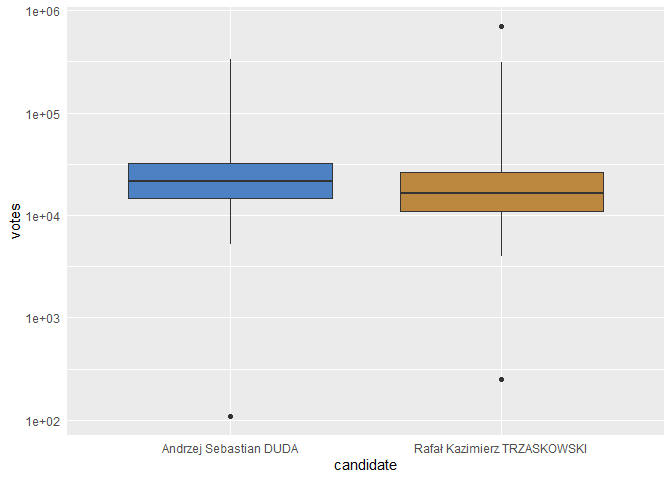
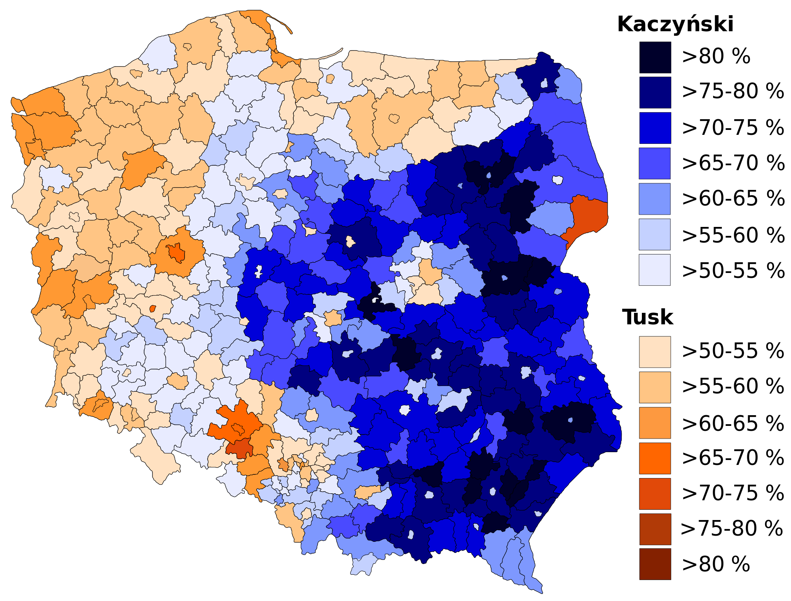
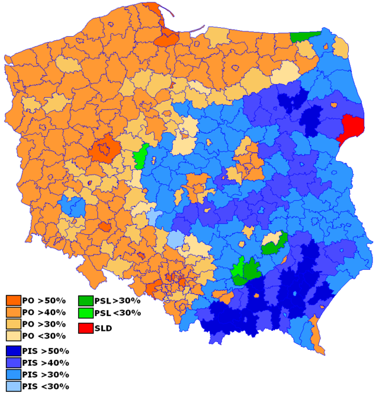
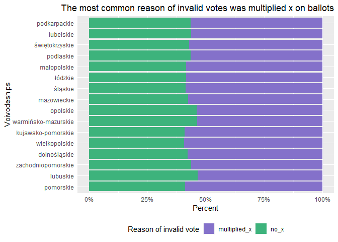

Presidential election - Poland 2020
================
Wiktor Piela
04 02 2021

# Introduction

On 12 July 2020, presidential election took place in Poland, in line
with polish constitutional law, then, Polish have elected president for
next tenure of 5 years. At this day was the run-off of two candidates
who got the biggest amount of votes in the first round of election 2
weeks before. It was a political duel for polish presidency of two
extremely different candidates - first, conservative candidate, Andrzej
Duda, current president of Republic of Poland who won presidential
election 5 years before, supported by ruling parliament coalition (Law
and Justice - Union Right) and the second one - Rafał Trzaskowski,
liberal candidate supported by most of oposition parties, current mayor
of Warsaw - capital city of Poland.

# Some statistics at the beginning

Before we begin the thorough analysis of the election results, we take a
look at some basic statistical measures and see if we come up with the
election result presented directly in the next chapter. First of all
distributions of cast votes for each candidate is worth to show -it may
suggests the first conclusions.

<!-- -->

The area on this chart presenting the results of president Duda in each
of the districts is clearly higher and more moved to the right side - it
means that the current president more often (of more districts) got more
votes - than his opponent. The chart shows that Trzaskowski got amount
of votes of range 5,000 - 10,000 more often than Duda (part of
Trzaskowski’s area moved on left), but Duda got amount of votes of range
10,000 - 100,000 more often than Trzaskowski (part of Duda’s area moved
on right). If we really understand this plot, we can already guess what
the election result will be from this attitude.

Let’s check boxplot to confirm first insights, there we will notice even
more.

<!-- -->

The box being assigned to Andrzej Duda is also visible higher (every
edge), it meas that Q1, median and Q3 is higher in Duda’s case. This
view actually says everything about the results without showing specific
percentage results. Any statistical measure of votes obtained by each
candidate is in favor of president Duda. Although the maximum number of
votes that Trzaskowski got is an outlier and the highest, but it doesn’t
matter, because Poland consists of many districts, where, as shown in
the above charts, Trzaskowski was worse than Adnrzej Duda.

<table class=" lightable-classic" style="font-family: Cambria; width: auto !important; margin-left: auto; margin-right: auto;">

<caption>

Duda vs Trzaskowski - statistical measures

</caption>

<thead>

<tr>

<th style="text-align:left;">

candidate

</th>

<th style="text-align:right;">

min

</th>

<th style="text-align:right;">

Q1

</th>

<th style="text-align:right;">

median

</th>

<th style="text-align:right;">

Q3

</th>

<th style="text-align:right;">

max

</th>

<th style="text-align:right;">

mean

</th>

</tr>

</thead>

<tbody>

<tr>

<td style="text-align:left;">

Andrzej Sebastian DUDA

</td>

<td style="text-align:right;">

110

</td>

<td style="text-align:right;">

14745.25

</td>

<td style="text-align:right;">

21310.5

</td>

<td style="text-align:right;">

32352.5

</td>

<td style="text-align:right;">

332554

</td>

<td style="text-align:right;">

27331.54

</td>

</tr>

<tr>

<td style="text-align:left;">

Rafał Kazimierz TRZASKOWSKI

</td>

<td style="text-align:right;">

250

</td>

<td style="text-align:right;">

10861.75

</td>

<td style="text-align:right;">

16338.5

</td>

<td style="text-align:right;">

26033.5

</td>

<td style="text-align:right;">

695559

</td>

<td style="text-align:right;">

26225.82

</td>

</tr>

</tbody>

</table>

Every significant measure indicates to the victory of Andrzej Duda in
the run-off of polish presidential election 2020.

# Who won this election?

Presidential election 2020 in Poland Andrzej Duda won, obtaining
10440648 of votes, on the other hand, for Rafał Trzaskowski 10018263 of
electors voted.

Below chart and table present the general results of election in
percentage value of votes cast on the territory of Poland and polish
community abroad.

<!-- -->

<table class=" lightable-classic" style="font-family: Cambria; width: auto !important; margin-left: auto; margin-right: auto;">

<caption>

Duda vs Trzaskowski - general results

</caption>

<thead>

<tr>

<th style="text-align:left;">

Candidate

</th>

<th style="text-align:right;">

Votes

</th>

<th style="text-align:right;">

Percent

</th>

</tr>

</thead>

<tbody>

<tr>

<td style="text-align:left;">

Andrzej Sebastian DUDA

</td>

<td style="text-align:right;">

10440648

</td>

<td style="text-align:right;">

51.03228

</td>

</tr>

<tr>

<td style="text-align:left;">

Rafał Kazimierz TRZASKOWSKI

</td>

<td style="text-align:right;">

10018263

</td>

<td style="text-align:right;">

48.96772

</td>

</tr>

</tbody>

</table>

**How was voted in given voivodeships individually?**

As per polish administrative law, country is divided by 16 provinces -
let’s see the results in each of them on below chart.

<!-- -->

In this step it is possible to notice something strange at the first
time - because Rafał Trzaskowski lose election although he won in 10 of
16 provinces in Poland, so how President-in-Office Duda achieve his
advantage winning only in 6 of 10 voivodeships? It exists a lot of
answers for this qestion beacuse there are a lot of reasons. I will try
to explain that by present analysis.

# Districts among voivodeships

The another provision of Polish administrative law is that each of the
16 voivodships is divided into districts - smaller administrative units.
If we have a look, how many discrincts given candidate won, it explain a
bit general results of election

<table class=" lightable-classic" style="font-family: Cambria; width: auto !important; margin-left: auto; margin-right: auto;">

<caption>

Duda vs Trzaskowski - districts

</caption>

<thead>

<tr>

<th style="text-align:left;">

Winner

</th>

<th style="text-align:right;">

district\_count

</th>

</tr>

</thead>

<tbody>

<tr>

<td style="text-align:left;">

DUDA

</td>

<td style="text-align:right;">

236

</td>

</tr>

<tr>

<td style="text-align:left;">

TRZASKOWSKI

</td>

<td style="text-align:right;">

144

</td>

</tr>

</tbody>

</table>

Althoungh Andrzej Duda won in 6 of 16 provinces, he took vicotry in 236
of 380 districts in Poland - it means that President-in-Office was more
supported by electors in more than 62% polish districts. It is the first
of a lot of insights explainig Duda’s victory. Below chart visualize and
explain current situation even better.

<!-- -->

Above I just counted districts grouped by voivodeships (geographically
and administrative appropriate) and output in shape of chart surprise
and give us more information. Have a look at the top - in podkarpackie
voivodeship there were no privinces where Rafał Trzaskowski won, and on
example of mazowieckie - as you remember Trzaskowski won there in
general, however Duda get advantage in 35 districts of mazowieckie, but
Trzaskowski in 9 of them. The case, when Duda won overwhelming advantage
of number of districts, repeats also in following provinces - lubelskie,
małopolskie, łódzkie, podlaskie.

# Real advantage by provinces

Not too important seems to be number of places where given candidate
beat the opponent but advantage in real cast votes. Pay attention to
below chart presents in what province given candidate won and with which
advantage.

<!-- -->

<table class=" lightable-classic" style="font-family: Cambria; width: auto !important; margin-left: auto; margin-right: auto;">

<caption>

Duda vs Trzaskowski - advantage analysis

</caption>

<thead>

<tr>

<th style="text-align:left;">

Winner

</th>

<th style="text-align:right;">

mean\_advantage

</th>

<th style="text-align:right;">

max\_advantage

</th>

<th style="text-align:right;">

min\_advantage

</th>

</tr>

</thead>

<tbody>

<tr>

<td style="text-align:left;">

DUDA

</td>

<td style="text-align:right;">

267163.0

</td>

<td style="text-align:right;">

463512

</td>

<td style="text-align:right;">

117731

</td>

</tr>

<tr>

<td style="text-align:left;">

TRZASKOWSKI

</td>

<td style="text-align:right;">

118059.3

</td>

<td style="text-align:right;">

251447

</td>

<td style="text-align:right;">

24034

</td>

</tr>

</tbody>

</table>

The numbers on above speak for themselves - Trzaskowski won in 10 of 16
provinces in fact but in this place his lead is finishing becasue,
current president got maximum advantage in podkarpackie voidoveship of
amount 463512 of votes, at the same time, Trzaskowski’s max advantantage
is equal 251447 in pomorskie province, it means that Duda was almost
1.84 times more supported by his best electors than Trzaskowski by their
own. Moreover, Duda was able to show off less almost 2.26 times higher
average advantage than his political opponent, more than 4.9 times
higher minium advantage achieved in łódzkie than Trzaskowski’s min
advantage from opolskie.

# Votes cast in each provinces - line plot

At the beginning I presented percentage results of elections by
provinces - now pay attention on line plot that shows real votes cast
for each of candidates, by voivodeships as well. Here we can notice that
orange points meaning Trzaskowski’s result are higher than blue ones
more frequently, but once blue’s are higher, there are bigger distance
above orange onces than on the toher hand. It confirms mentioned
insights so far - that Duda won less frequently, but with higher
advantage.

<!-- -->

# Districts - advantage analysis

We have talked a lot of advantage before, so now let’s see how it looks
like in specific districts. Below I selected two different districts,
with the biggest percentage advantage of each candidate.

<!-- -->

<table class=" lightable-classic" style="font-family: Cambria; width: auto !important; margin-left: auto; margin-right: auto;">

<caption>

Duda vs Trzaskowski - advantage analysis

</caption>

<thead>

<tr>

<th style="text-align:left;">

Powiat

</th>

<th style="text-align:right;">

duda

</th>

<th style="text-align:right;">

trzask

</th>

<th style="text-align:right;">

difference

</th>

<th style="text-align:left;">

descritpion

</th>

</tr>

</thead>

<tbody>

<tr>

<td style="text-align:left;">

janowski

</td>

<td style="text-align:right;">

84.20585

</td>

<td style="text-align:right;">

15.79415

</td>

<td style="text-align:right;">

68.41170

</td>

<td style="text-align:left;">

Duda’s max advantage

</td>

</tr>

<tr>

<td style="text-align:left;">

Sopot

</td>

<td style="text-align:right;">

27.83662

</td>

<td style="text-align:right;">

72.16338

</td>

<td style="text-align:right;">

44.32677

</td>

<td style="text-align:left;">

Trzaskowski’s max advantage

</td>

</tr>

</tbody>

</table>

Duda’s the greatest victory area was in janowski district, there he got
almost 68.5% more votes than liberal candidate. Trzaskowski won in city
of Sopot with the biggest difference winning there with Duda of about
44% more of votes. It is very easy to notice that both differences are
incomparable and in those two areas, conservstive elector are once again
more mobilized to vote than liberal one.

# The 15 largest cities in Poland

Very characteristic of every election are results from the biggest
agglomerations - I present you how it was voted there, I chose the 15
the most inhabited cities in Poland and I ordered descending.

<!-- -->

<table class=" lightable-classic" style="font-family: Cambria; width: auto !important; margin-left: auto; margin-right: auto;">

<caption>

Duda vs Trzaskowski - advantage analysis

</caption>

<thead>

<tr>

<th style="text-align:left;">

Powiat

</th>

<th style="text-align:right;">

Andrzej Sebastian DUDA

</th>

<th style="text-align:right;">

Rafał Kazimierz TRZASKOWSKI

</th>

<th style="text-align:left;">

Winner

</th>

</tr>

</thead>

<tbody>

<tr>

<td style="text-align:left;">

Warszawa

</td>

<td style="text-align:right;">

32.34606

</td>

<td style="text-align:right;">

67.65394

</td>

<td style="text-align:left;">

Trzaskowski

</td>

</tr>

<tr>

<td style="text-align:left;">

Kraków

</td>

<td style="text-align:right;">

38.53156

</td>

<td style="text-align:right;">

61.46844

</td>

<td style="text-align:left;">

Trzaskowski

</td>

</tr>

<tr>

<td style="text-align:left;">

Łódź

</td>

<td style="text-align:right;">

36.17141

</td>

<td style="text-align:right;">

63.82859

</td>

<td style="text-align:left;">

Trzaskowski

</td>

</tr>

<tr>

<td style="text-align:left;">

Wrocław

</td>

<td style="text-align:right;">

33.38160

</td>

<td style="text-align:right;">

66.61840

</td>

<td style="text-align:left;">

Trzaskowski

</td>

</tr>

<tr>

<td style="text-align:left;">

Poznań

</td>

<td style="text-align:right;">

28.05668

</td>

<td style="text-align:right;">

71.94332

</td>

<td style="text-align:left;">

Trzaskowski

</td>

</tr>

<tr>

<td style="text-align:left;">

Gdańsk

</td>

<td style="text-align:right;">

29.82166

</td>

<td style="text-align:right;">

70.17834

</td>

<td style="text-align:left;">

Trzaskowski

</td>

</tr>

<tr>

<td style="text-align:left;">

Szczecin

</td>

<td style="text-align:right;">

36.32015

</td>

<td style="text-align:right;">

63.67985

</td>

<td style="text-align:left;">

Trzaskowski

</td>

</tr>

<tr>

<td style="text-align:left;">

Lublin

</td>

<td style="text-align:right;">

48.76392

</td>

<td style="text-align:right;">

51.23608

</td>

<td style="text-align:left;">

Trzaskowski

</td>

</tr>

<tr>

<td style="text-align:left;">

Bydgoszcz

</td>

<td style="text-align:right;">

37.18212

</td>

<td style="text-align:right;">

62.81788

</td>

<td style="text-align:left;">

Trzaskowski

</td>

</tr>

<tr>

<td style="text-align:left;">

Katowice

</td>

<td style="text-align:right;">

38.46833

</td>

<td style="text-align:right;">

61.53167

</td>

<td style="text-align:left;">

Trzaskowski

</td>

</tr>

<tr>

<td style="text-align:left;">

Białystok

</td>

<td style="text-align:right;">

47.79975

</td>

<td style="text-align:right;">

52.20025

</td>

<td style="text-align:left;">

Trzaskowski

</td>

</tr>

<tr>

<td style="text-align:left;">

Gdynia

</td>

<td style="text-align:right;">

29.94169

</td>

<td style="text-align:right;">

70.05831

</td>

<td style="text-align:left;">

Trzaskowski

</td>

</tr>

<tr>

<td style="text-align:left;">

Częstochowa

</td>

<td style="text-align:right;">

44.36649

</td>

<td style="text-align:right;">

55.63351

</td>

<td style="text-align:left;">

Trzaskowski

</td>

</tr>

<tr>

<td style="text-align:left;">

Radom

</td>

<td style="text-align:right;">

55.40604

</td>

<td style="text-align:right;">

44.59396

</td>

<td style="text-align:left;">

Duda

</td>

</tr>

<tr>

<td style="text-align:left;">

Sosnowiec

</td>

<td style="text-align:right;">

40.83719

</td>

<td style="text-align:right;">

59.16281

</td>

<td style="text-align:left;">

Trzaskowski

</td>

</tr>

</tbody>

</table>

In general, bigger cities are inhabited by more liberal electorate
basically, that’s why Rafał Trzaskowski was supported there especially
and won in 14 of 15 the biggest cities in Poland. However not everywhere
he got as big advantage as expected - for example Częstochowa, Lubin and
Białystok.

# Eletion results in special constituencies

Remember that election takes place out of Poland territory, counting
votes, electoral commission needs to include votes of polish community
abroad and from ships - they are special voting districts.

<!-- -->

Rafał Trzaskowski got there pretty high results, considerable percentage
advantage over Duda, having about 3/4 of votes abroad and more or less
70% of support from electorate voting on ships.

# West and East - geography and elections in Poland

The political history of Poland after 1989 shows that the results of the
elections in Poland are dependent on the geographical location of the
voivodeship, where the east is inhabited by a more Catholic and
conservative electorate with national values, and the western part of
Poland, the so-called recovered territories, represents a more liberal,
progressive electorate with pro-European values. To explain more
mentioned phenomenon, below I put results of presitendial election in
Poland 2005, parliamentary election 2011.

The geographically division of voting preferences is visible, I have
deliberately presented those elections as example (quiet long time
between them) in order to show that this is a constant phenomenon and
continues - it is not a one-off case.

To the needs of current analysis of election 2020, I counted cast votes
grouped by East and West - every voivodeship I assigned to proper
geographically scope. I have guided by the following principles: \*
geography \* I have tried to make the population of each scope as
similar to each other as possible, so that the results are reliable and
not manipulated

<table class=" lightable-classic" style="font-family: Cambria; width: auto !important; margin-left: auto; margin-right: auto;">

<caption>

Data manipulation - table

</caption>

<thead>

<tr>

<th style="text-align:left;">

Województwo

</th>

<th style="text-align:right;">

Population

</th>

<th style="text-align:right;">

proportion

</th>

</tr>

</thead>

<tbody>

<tr>

<td style="text-align:left;">

West

</td>

<td style="text-align:right;">

14639328

</td>

<td style="text-align:right;">

48.36

</td>

</tr>

<tr>

<td style="text-align:left;">

East

</td>

<td style="text-align:right;">

15629132

</td>

<td style="text-align:right;">

51.64

</td>

</tr>

</tbody>

</table>

Results are the same as expected - most of voted supported Andrzej Duda
comes from East of Poland, Trzaskowski with visible advantage on West
voivodeships:

<!-- -->

It confirms supposition mentioned before. However - at the same time, we
are able to see that difference for Duda on East seems to be higher than
for Trzaskowski on West. Zooming on below table presented numbers
precisely - East Duda’s advantage is bigger than Trzaskowski’s on West
equally 1.43 times.

<table class=" lightable-classic" style="font-family: Cambria; width: auto !important; margin-left: auto; margin-right: auto;">

<caption>

Duda vs Trzaskowski by Polish regions

</caption>

<thead>

<tr>

<th style="text-align:left;">

Województwo

</th>

<th style="text-align:right;">

Duda

</th>

<th style="text-align:right;">

Trzaskowski

</th>

<th style="text-align:left;">

Winner

</th>

<th style="text-align:right;">

Advantage

</th>

</tr>

</thead>

<tbody>

<tr>

<td style="text-align:left;">

West

</td>

<td style="text-align:right;">

4375631

</td>

<td style="text-align:right;">

5357610

</td>

<td style="text-align:left;">

Trzaskowski

</td>

<td style="text-align:right;">

981979

</td>

</tr>

<tr>

<td style="text-align:left;">

East

</td>

<td style="text-align:right;">

6065017

</td>

<td style="text-align:right;">

4660653

</td>

<td style="text-align:left;">

Duda

</td>

<td style="text-align:right;">

1404364

</td>

</tr>

</tbody>

</table>

Let’s divide East and West region on existing districts

<!-- -->

<table class=" lightable-classic" style="font-family: Cambria; width: auto !important; margin-left: auto; margin-right: auto;">

<caption>

Districts by Region

</caption>

<thead>

<tr>

<th style="text-align:left;">

Region

</th>

<th style="text-align:left;">

Winner

</th>

<th style="text-align:right;">

Distrinct\_counting

</th>

<th style="text-align:right;">

Percent

</th>

</tr>

</thead>

<tbody>

<tr>

<td style="text-align:left;">

East

</td>

<td style="text-align:left;">

Duda

</td>

<td style="text-align:right;">

161

</td>

<td style="text-align:right;">

84.29319

</td>

</tr>

<tr>

<td style="text-align:left;">

East

</td>

<td style="text-align:left;">

Trzaskowski

</td>

<td style="text-align:right;">

30

</td>

<td style="text-align:right;">

15.70681

</td>

</tr>

<tr>

<td style="text-align:left;">

West

</td>

<td style="text-align:left;">

Trzaskowski

</td>

<td style="text-align:right;">

116

</td>

<td style="text-align:right;">

60.73298

</td>

</tr>

<tr>

<td style="text-align:left;">

West

</td>

<td style="text-align:left;">

Duda

</td>

<td style="text-align:right;">

75

</td>

<td style="text-align:right;">

39.26702

</td>

</tr>

</tbody>

</table>

As we can see, Duda won in almost 85 percent of the eastern districts,
while Trzaskowski was victorious in just over 60 percent of the western
ones. It is possible to see at this point the huge advantage of the
conservative candidate.

# Unique districts

Now let’s examine the exceptions, districts stand out against the
background of the voivodship results (separately for each of candidate).
See which districts stood out and with what exactly results.

<!-- -->

<table class=" lightable-classic" style="font-family: Cambria; width: auto !important; margin-left: auto; margin-right: auto;">

<caption>

Trzaskowski’s results of outstanding districts

</caption>

<thead>

<tr>

<th style="text-align:left;">

Powiat

</th>

<th style="text-align:left;">

Województwo

</th>

<th style="text-align:right;">

trzask\_powiat

</th>

<th style="text-align:right;">

trzask\_woj

</th>

<th style="text-align:right;">

difference

</th>

</tr>

</thead>

<tbody>

<tr>

<td style="text-align:left;">

hajnowski

</td>

<td style="text-align:left;">

podlaskie

</td>

<td style="text-align:right;">

0.6111346

</td>

<td style="text-align:right;">

0.3985958

</td>

<td style="text-align:right;">

0.2125388

</td>

</tr>

<tr>

<td style="text-align:left;">

przysuski

</td>

<td style="text-align:left;">

mazowieckie

</td>

<td style="text-align:right;">

0.2006721

</td>

<td style="text-align:right;">

0.5226336

</td>

<td style="text-align:right;">

\-0.3219615

</td>

</tr>

</tbody>

</table>

The hajnowski district in Podlaskie voivodship stands out definitely in
favor of the Trzaskowski - there he got more than 60 percent of votes,
however only 40 percent cast votes in Podlaskie were for him -
difference equals about 20 percentage points in liberal candidate favor.
On the contrary - in przysuski district (Pomorskie voivodeship) only
about 20 percent of electors supported him, but in the same province (in
general) more than 50 percent of poeple cast for him, so the
disadvantage is more than 30 percentage points in here.

Exactly the same action we are able to in case of Duda’s results -
checking outstanding districts - to the advantage and disadvantage.

<!-- -->

<table class=" lightable-classic" style="font-family: Cambria; width: auto !important; margin-left: auto; margin-right: auto;">

<caption>

Duda’s results of outstanding districts

</caption>

<thead>

<tr>

<th style="text-align:left;">

Powiat

</th>

<th style="text-align:left;">

Województwo

</th>

<th style="text-align:right;">

duda\_powiat

</th>

<th style="text-align:right;">

duda\_woj

</th>

<th style="text-align:right;">

difference

</th>

</tr>

</thead>

<tbody>

<tr>

<td style="text-align:left;">

przysuski

</td>

<td style="text-align:left;">

mazowieckie

</td>

<td style="text-align:right;">

0.7993279

</td>

<td style="text-align:right;">

0.4773664

</td>

<td style="text-align:right;">

0.3219615

</td>

</tr>

<tr>

<td style="text-align:left;">

hajnowski

</td>

<td style="text-align:left;">

podlaskie

</td>

<td style="text-align:right;">

0.3888654

</td>

<td style="text-align:right;">

0.6014042

</td>

<td style="text-align:right;">

\-0.2125388

</td>

</tr>

</tbody>

</table>

What are the output that we got? Exactly the opposite - the same
districts, the same values but on the contrary. Duda lost the most in
the hajnowski district in podlaskie, he gained the most in przysuski in
pomorskie. In this measurement the advantage is also visible on the
Duda’s side. Taking into account only these two extreme districts, the
net advantage of President is equal 10.94 of percentage points - the
difference between adventage how Duda and Trzaskowski achieved. Above
means, whose voters and how mobilized they were to vote for their
candidate.

# Voter turnout

Overall voter turnout was 68.18 percent and was one of the highest h in
the history of Poland after 1989. In this election were cast in total
20636635 valid votes. It shows how important these elections were for
Poles and that the voters of both candidates were very mobilized to
vote.

As below chart shows, the highest turnout has been registered in
mazowieckie voivodeship, while the lowest in opolskie.

<!-- -->

**The highest and the lowest voter turnout by districts**

<!-- -->

If we have a closer look at the turnout in districts, it is possible to
notice an interesting thing, because the lowest turnout among all
districts was in the krapkowicki district in opolskie, however the
highest has been in pucki located in pomorskie, not mazowieckie, where
overall turnout was the highest among all provinces.

# The unique districts - turnout results

As before with the election results, let’s take a look at the districts
distinguished by turnout results compared to the voivodeship where
located. We will consider two possibilities, stood out by the maximum
difference in plus and in minus compared with provinces tendency.

<!-- -->

<table class=" lightable-classic" style="font-family: Cambria; width: auto !important; margin-left: auto; margin-right: auto;">

<caption>

Voter turnout analysis - districts

</caption>

<thead>

<tr>

<th style="text-align:left;">

Powiat

</th>

<th style="text-align:left;">

Województwo

</th>

<th style="text-align:right;">

wojew\_attendance

</th>

<th style="text-align:right;">

powiat\_attendance

</th>

<th style="text-align:right;">

difference

</th>

</tr>

</thead>

<tbody>

<tr>

<td style="text-align:left;">

sztumski

</td>

<td style="text-align:left;">

pomorskie

</td>

<td style="text-align:right;">

0.7004291

</td>

<td style="text-align:right;">

0.5683389

</td>

<td style="text-align:right;">

\-0.1320902

</td>

</tr>

<tr>

<td style="text-align:left;">

Opole

</td>

<td style="text-align:left;">

opolskie

</td>

<td style="text-align:right;">

0.5991564

</td>

<td style="text-align:right;">

0.6954226

</td>

<td style="text-align:right;">

0.0962662

</td>

</tr>

</tbody>

</table>

As you remember the lowest turnout was in the opolskie voivodeship,
where the turnout was increased by the city of Opole, where the voter
turnout was more than 9 percentage points higher than in the entire
voivodeship. On the other hand, over 70 percent of the turnout in the
pomorskie voivodship is lowered by the sztusmi district, where the
turnout didn’t exceed 57 percent. There, the turnout was lower by over
13 percentage points compared to the overall result for the voivodeship.

# West Poland and East Poland - voter turnout comparison

The same way as I did before, now dividing Poland by two regions - East
and West, I would like to show how does voter turnout present grouped by
this way - division method is exactly the same as in the previous
section when analyzing the election results.

<!-- -->

It is easy to notice that eastern electorate was more mobilized to vote,
because only in this part of Poland voter turnout almost exceeds 70
percent. Especially considering that in the eastern provinces Duda wins,
it may mean that his electorate was more mobilized to support him and
help him to win presidential elections.

# Invalid votes

A vote is invalid if one of two cases happen - ballot paper taken from
ballot box is clear (no “x” sign) or there is put more than one “x”. In
total, in the presidential election all over Poland were cast 177724
votes and it is 0.87 of all votes cast. Have a look at below chart to
check how it looks like in each specific province (and who won there).

<!-- -->

**Invalid votes - reason**

As I mentioned before it is considered two main reasons why vote is
invalid:

  - ballot with no “x” sign meaning choice of given candidate
  - ballot with more than one “x” sign

Let’s check which reason for the invalidity of the vote was dominant in
each of provinces individually.

<!-- -->

So the dominant reason was putting an x sign next to more than one
candidate (doubled x). In total in Poland has been cast 177724 of
invalid votes, of which 75271 due to no marking and 102453 because of
muntiplied X on ballot paper - it is accordingly 42.35 percent and 57.65
percent of invalid votes amount overall.
