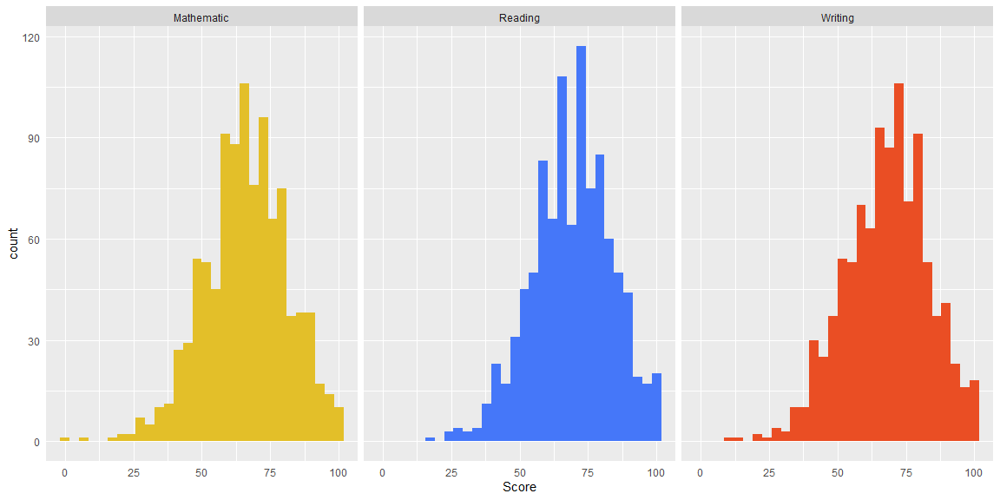

Students exam performance - analysis
================
Wiktor Piela
19 03 2021

# Introduction

Current dataset includes exam results of 1000 students divided by
specific areas- mathematic skills, reading and writing. Possibility to
deeper analysis provide us additional information like parents
education, how were students prepared to exam and finally quality of
meals that they have eaten. We can also find out the gender of every
student and ethnicity group they belong to. I will try to investigate,
which factor could have the biggest impact on exam result, find
something interesting, present general information and visualize that
and try to describe features of the best student and the worst one.

# Distribution of exam results and skewness

To average exam results I use median measure, because in case of each of
subject, distribution of results are skewed towards the left:

  - skewness coefficient in case of math score is equal -0.28
  - related to reading part -0.26
  - in according to writing part -0.29

*Negative value indicates that distribution is skewed towards the left*

Although the skewness isn’t too strong, it seem to be more objectively
to use median as average measure. Below I present distribution of
scores, divided by each of subject separately to confirm my assumptions.

# Initial insights

As below correlation matrix shows, there is not much difference between
results of every subjects- it means that the average student’s results
were not very different when considering each subject separately and
they compare them to each other. For example, the student who got in
writing 10 points, in reading 50 and in math 80 - doesn’t exists. The
scoring that students achieved of each subject are very similar to each
other.

# Gender

Let’s present how did each of gender deal with exam in general and how
it looks like once we consider every specific subject separately.

<table class="table table-bordered" style="font-family: Cambria; margin-left: auto; margin-right: auto;">

<caption>

Results table

</caption>

<thead>

<tr>

<th style="text-align:left;">

gender

</th>

<th style="text-align:right;">

min

</th>

<th style="text-align:right;">

Q1

</th>

<th style="text-align:right;">

median

</th>

<th style="text-align:right;">

Q3

</th>

<th style="text-align:right;">

max

</th>

<th style="text-align:right;">

mean

</th>

</tr>

</thead>

<tbody>

<tr>

<td style="text-align:left;">

female

</td>

<td style="text-align:right;">

10

</td>

<td style="text-align:right;">

62

</td>

<td style="text-align:right;">

72

</td>

<td style="text-align:right;">

81

</td>

<td style="text-align:right;">

100

</td>

<td style="text-align:right;">

71.00965

</td>

</tr>

<tr>

<td style="text-align:left;">

male

</td>

<td style="text-align:right;">

23

</td>

<td style="text-align:right;">

55

</td>

<td style="text-align:right;">

66

</td>

<td style="text-align:right;">

75

</td>

<td style="text-align:right;">

100

</td>

<td style="text-align:right;">

65.40664

</td>

</tr>

</tbody>

</table>

Generally, the females used to look better than males in exam, because
if we focus on median points scored by both gender’s, it gives us
difference of 6 points on females favour. However, important to note it
that the worst average results in whole dataset gets one of women. The
situation looks quite different when we consider all of subjects
separately.

The skills of males are definitely opposite than female ones, because
males got the best results in math, later- in reading, and finally, the
worst in writing; in case of females order is opposite. In line with
average results- randomly selected male is:

  - better than randomly selected female of 4 points in math

  - worse than randomly selected female of 10 points in writing

  - worse than randomly selected female of 7 point in reading

# Ethnicity groups

Also every participant of research belong to one of five specific
ethnicity group. For further investigation, I present the approximate
results of each of groups.

Groups A and E seem to be the most outstanding, the first one achieving
the worst result and second one, the highest scoring. Average points
that rest of groups got are rather similar.

Have a look how did each of groups deal with specific subjects:

As expected, the best results in every subject compared to other groups,
achieved group E. They were the best especially in math, later in
reading and in writing at the end. As it turned out, in maths, the worst
group was A, also in writing group A scored the worst. Very important to
mention is that all of presented values show no too big differences
between each other. It follows that very high correlation coefficient
that I mentioned at the beginning in initial insights chapter.

# Gender vs ethnicity groups

*Gender distribution by groups*

The smallest number of women is in group A, and the largest number in
group C.

It could be interesting to show, whether in each of groups, females
scored better than males- such as in general investigating only by sex.

Basically, females used to look higher than males on exam in each of the
groups. However, the advantage of women over men in specific groups
seems to be of particular interest, becasue in case of groups from A to
D the difference on the plus side of females is very huge, because
often, median results of females is equal about first quartile of males
amoung groups. The exception is group E where both of gender got similar
average exam’s results.

# Factors affecting exam results

We already know two base features of student’s - sex and their ethnicity
groups, now let’s consider what factors have a real impact on the
student’s results in the exam, the same, we will try to explain why
females achieved better results and why some ethnicity groups were doing
better than other ones.

# 1st factor- parental level of education

Even without investigating the data, it could be assumed that this
factor have a direct impact on the exam results, but let’s see what the
dataset shows. First of all, let’s check whether children of better
graduated parents used to get higher scoring of the exam.

It is clearly visible that on the given dataset there is a relationship,
the higher the education of the parents, the higher the results.
Differences between the groups are not very large, but it comes from the
correlation mentioned at the beginning- the student’s performance in
each of subject was not very different related to scoring achieved.

Let’s see how the results presents divided by individual subjects
separately.

Also in this approach, children of master’s degree graduated, especially
in reading, did much better than others. Children of people with lower
university education, in reading and writing, obtained points similar to
the results in mathematics of students who parents are the best
educated. While children who parents did or didn’t high school scored
the worst of all - they obtained the worst results especially in maths.

*Parental level of education among gender*

In this step it seems to be important to consider impact on exam results
of parental level of education among gender and ethnicity groups to
check possible relationships.

At least two facts can be said about the above breakdown:

1.  Parents’ education level seems to have an impact on the exam results
    as it is clear visible that children of better educated parents
    scored better on the exam.

2.  In the group of children of the best educated parents (master’s
    degree), on average men obtained better results than women, which is
    an exception and quite a surprise. It is worth considering why.

Above chart shows why among students whose parents did master’s degree,
males, on average, used to achieve better results than females- this is
because of the results in math and reading. The median of men’s results
in mathematics is almost equal to third quartile of women’s results in
this subject. Difference is huge and affects the final results in the
group, in addition, there is also quite a slight advantage of men in
reading.

*Parental level of education among ethnicity groups*

It can be said at first glance that the level of parent’s education
affects the results on the exam, because performance each of ethnicity
groups is increasing in line with education level of parents, however-
there is a fact that should be mentioned:

1.  Ethnicity groupe E not always scored the best from parent’s
    education level perspective.

2.  The surprise is the result of a fundamentally low scored group B
    whose parents are on master’s degree level. As you will able to see
    below, it is because of higher performance especially in writing and
    reading.

# 2nd factor - preparation course participation

As above chart shows, minority of students have participated a
preparation course for the exam. Let’s compare the results of prepared
and not prepared students.

*Whether the children of better educated parents are more likely to take
part in the preparation course?*

<table class=" lightable-classic" style="font-family: Cambria; margin-left: auto; margin-right: auto;">

<caption>

Who more willingly took part in the course

</caption>

<thead>

<tr>

<th style="text-align:left;">

parental\_level\_of\_education

</th>

<th style="text-align:left;">

completed

</th>

<th style="text-align:left;">

none

</th>

</tr>

</thead>

<tbody>

<tr>

<td style="text-align:left;">

some high school

</td>

<td style="text-align:left;">

43.02%

</td>

<td style="text-align:left;">

56.98%

</td>

</tr>

<tr>

<td style="text-align:left;">

high school

</td>

<td style="text-align:left;">

28.57%

</td>

<td style="text-align:left;">

71.43%

</td>

</tr>

<tr>

<td style="text-align:left;">

some college

</td>

<td style="text-align:left;">

34.07%

</td>

<td style="text-align:left;">

65.93%

</td>

</tr>

<tr>

<td style="text-align:left;">

associate’s degree

</td>

<td style="text-align:left;">

36.94%

</td>

<td style="text-align:left;">

63.06%

</td>

</tr>

<tr>

<td style="text-align:left;">

bachelor’s degree

</td>

<td style="text-align:left;">

38.98%

</td>

<td style="text-align:left;">

61.02%

</td>

</tr>

<tr>

<td style="text-align:left;">

master’s degree

</td>

<td style="text-align:left;">

33.90%

</td>

<td style="text-align:left;">

66.10%

</td>

</tr>

</tbody>

</table>

As it turns out, the willingness to take part in the exam preparation
course doesn’t increase with the parent’s education level, because the
most interested and least interested group are the children of people
who didn’t or did only high school.

*Course participation by sex*

As above chart simply shows- prepared students used to achieve higher
results than other ones, but to confirm, it is necessary to see how it
looks like among second feature- ethnicity group.

*Course participation by ethnicity groups*

At this step, the hypothesis is also confirmed, it is also interesting
that in a given ethnic group the point difference between the
participants and the non-participants decreases with each subsequent
group. Escpecially, the advantage of participated students is visible in
group A. It is also worth to notice that if we consider only students
participating in the course, the difference between the individual
groups is not as visible as in the total summary.

Then, it appears that participating the course had an impact on the
results as the point differences between ethnic groups were reduced from
perspective of prepared students.

However, to definitely confirm hypothesis that test preparation course
affected on exam reslts, I assigned every student to proper group by
performance and I checked how many of them participated the course.

<table class=" lightable-classic" style="font-family: Cambria; margin-left: auto; margin-right: auto;">

<caption>

High-scored students more likely participated the preparation course

</caption>

<thead>

<tr>

<th style="text-align:left;">

student\_type

</th>

<th style="text-align:left;">

completed

</th>

<th style="text-align:left;">

none

</th>

</tr>

</thead>

<tbody>

<tr>

<td style="text-align:left;">

worse student

</td>

<td style="text-align:left;">

20.16%

</td>

<td style="text-align:left;">

79.84%

</td>

</tr>

<tr>

<td style="text-align:left;">

ordinary student

</td>

<td style="text-align:left;">

29.50%

</td>

<td style="text-align:left;">

70.50%

</td>

</tr>

<tr>

<td style="text-align:left;">

better student

</td>

<td style="text-align:left;">

40.93%

</td>

<td style="text-align:left;">

59.07%

</td>

</tr>

<tr>

<td style="text-align:left;">

the best student

</td>

<td style="text-align:left;">

53.41%

</td>

<td style="text-align:left;">

46.59%

</td>

</tr>

</tbody>

</table>

It looks like, more share of students who got higher resutls,
participated the preparation course. It could means that course was
effective and affected on exam performance of students, because:

1.  Bigger share of students with better results participated in the
    course what probably mean that they did better

2.  From ethnic groups perspective, the results of students
    participating in the course don’t differ as much as in general

3.  It is not true that, children of better educated parents are more
    likely to take part in the preparation course, what would upset
    insights at this step.

# 3rd factor - type of lunch

As you know, mental effort requires energy intake, so it is important to
eat a wholesome meal before your exam. Also in our dataset, some
students ate a full meal, others didn’t take a meal at all, or a reduced
one. We can compare the performance of students on exam based on this
criterion.

*Lunch by gender and ethnicity groups*

After review of the above two charts, we shouldn’t have any doubts; the
lunch type affected directly on exam performance of students, because
mentioned tendency is visible and correspond to analysis of base
features that we did at the beginning.

*Did who eat what?*

As it turns out that in the group of better students there is a greater
share of people who have eaten wholesome (standard) meal before the
exam.

*How did the representatives of the best ethnic groups eat? And how the
worst*

As I showed at the beginning, the group that scored the best in the exam
was group E, while the worst group A. How the students in these groups
eat?

<table class=" lightable-classic" style="font-family: Cambria; margin-left: auto; margin-right: auto;">

<caption>

Lunch type of group A and E

</caption>

<thead>

<tr>

<th style="text-align:left;">

ethnicity\_group

</th>

<th style="text-align:left;">

free/reduced

</th>

<th style="text-align:left;">

standard

</th>

</tr>

</thead>

<tbody>

<tr>

<td style="text-align:left;">

group A

</td>

<td style="text-align:left;">

40.45%

</td>

<td style="text-align:left;">

59.55%

</td>

</tr>

<tr>

<td style="text-align:left;">

group E

</td>

<td style="text-align:left;">

29.29%

</td>

<td style="text-align:left;">

70.71%

</td>

</tr>

</tbody>

</table>

**Why in my opinion lunch type affect on the exam performance of
students?**

  - over 70 percent of the students in group E, who scored the best in
    the exam, ate a standard meal before the exam, at the same time, in
    group A the same share is equal about 59.5%

  - in group A, which scored the worst, most students took up an exam
    eating reduced meal or without any

# Features of the best and the worst students

Before I sum up all of findings, let’s describe profile of the best and
the worst students taking up the exam.

<table class="table" style="font-family: Cambria; margin-left: auto; margin-right: auto;">

<caption>

the best and the worst student - features and profile

</caption>

<thead>

<tr>

<th style="text-align:left;">

gender

</th>

<th style="text-align:left;">

ethnicity\_group

</th>

<th style="text-align:left;">

parental\_level\_of\_education

</th>

<th style="text-align:left;">

lunch

</th>

<th style="text-align:left;">

test\_preparation\_course

</th>

<th style="text-align:right;">

score

</th>

<th style="text-align:right;">

count

</th>

</tr>

</thead>

<tbody>

<tr>

<td style="text-align:left;">

female

</td>

<td style="text-align:left;">

group D

</td>

<td style="text-align:left;">

bachelor’s degree

</td>

<td style="text-align:left;">

free/reduced

</td>

<td style="text-align:left;">

completed

</td>

<td style="text-align:right;">

100.0

</td>

<td style="text-align:right;">

2

</td>

</tr>

<tr>

<td style="text-align:left;">

female

</td>

<td style="text-align:left;">

group B

</td>

<td style="text-align:left;">

some high school

</td>

<td style="text-align:left;">

free/reduced

</td>

<td style="text-align:left;">

none

</td>

<td style="text-align:right;">

41.5

</td>

<td style="text-align:right;">

2

</td>

</tr>

</tbody>

</table>

It is turning out that the best student is a female belonging to group
D, coming from family with university education level - bachelor’s
degree, eating reduced meal or don’t eating lunch before the exam, with
completed test preparation course. Averagely, the student like that, got
100 points. In dataset there are 2 people having exactly the same
features.

On the other hand, features of student, who scored the worst, are
following: it is male from group B, child of parents who didn’t high
school, eating reduced meal or didn’t eat meal before the exam at all,
non-participated test preparation course. People the same like described
there are also 2 in dataset.

It is quite surprising, because we would expect the best features for
the best person, and for the person with the weakest results, the
weakest features. However, it is a bit different.

# Final insights vs my initial assumptions

1.  as it turned out, the exam’s performance were mainly driven by the
    parents’ education level and the type of meal consumed by students
    and also participation in test preparation course

2.  females used to scored better, but if we consider each subject
    separately, males, in mathematics, achieved more points than females

3.  the best educated were parents of students from group E and also
    females come from better graduated families than males.

4.  the willingness to take part in the exam preparation course doesn’t
    increase with the parent’s education level, because the most
    interested and least interested group are the children of people who
    didn’t or did only high school, however I expected visible tendency
    related to this matter

5.  most share of men are in group A and because of they on average
    scored lower than women, it should not be surprising that finally
    group A scored the worst in the exam

6.  from almost all of perspectives females scored better than males,
    except perental level of education perspective- there, considering
    children of master’s degree parents, averagely, males got higher
    score than females, as I proved, because of performance in
    mathematic, where males were much better
